# Week 0 — Billing and Architecture

## Required Homework

- [Live Stream](#project-scenario)
- [Spend Considerations](#spend-considerations)
- [Security Considerations](#security-considerations)
- [Napkin Design](#create-conceptual-design)
- [Logical Design](#create-a-logical-design)
- [Create Admin User](#iam-user)
- [Use CloudShell](#cloudshell)
- [Generate AWS Credentials](#create-access-keys)
- [Installed AWS CLI](#install-aws-cli)
- [Create a Billing Alarm](#create-billing-alarm-using-aws-cli)
- [Create a Budget](#create-aws-budget-using-aws-cli)

## Homework Challenges

- [Adding AWS_CLI_AUTO_PROMPT to .zshrc](#1-adding-aws_cli_auto_prompt-to-zshrc)
- [CI/CD Pipeline](#2-cicd-pipeline)
- [Use EventBridge to hookup Health Dashboard to SNS](#3-use-eventbridge-to-hookup-health-dashboard-to-sns)
- [Serverless Notification API](#4-serverless-notification-api)
- [Destroy root account credentials, Set MFA, IAM role](#5-destroy-root-account-credentials-set-mfa-iam-role)

---

## Getting Started

I began by completing all of the prerequisite tasks that I did not already know/have.

- Created a new AWS account with free tier benefits.
  - A neat trick I learned is that by using aliases, you can use the same email address to create multiple AWS accounts.
  - if your email is example@example.com, you can use example+something@example.com
- Did the free CCP course from Exampro to get familiar with AWS.
- Created Gitpod account.
- Created Momento Account.
- Obtained a Custom Domain Name from Porkbun.
- Signed up for Lucid Charts.
- Signed up for HoneyComb.io.
- Signed up for Rollbar.

---

## Project Scenario

The first thing I learned from the live session was how to understand the project and how an organization approaches it. How this is communicated via user personas has greatly aided my understanding of how things are done in an organization.

**Cruddur** is an ephemeral first micro-blogging platform ( a lot like Twitter but the posts are ephemeral like Snapchat posts)

- Backend uses Flask micro web framework (Python)
- Frontend uses React
- The project includes
  - SQL and NoSQL Databases
  - Realtime Modern APIs
  - Multiple Container Services ( *Microservices)
  - A CI/CD Pipeline
  - Decentralized Authentication
  - And more


## Architecting Cloud

Before building out the project, clearly understand what the business wants, so discuss it with the technical and business team and make sure it meets all of the project's requirements.

It should address the risks, assumptions, and constraints.

There are 3 stages to designing an architectural diagram.

1. Conceptual Design
2. Logical Design
3. Physical Design

### Conceptual Design

This is a high-level design that only shows the project's basic operation. Typically used to communicate an idea to business stakeholders or other non-technical members. Because it can be done on a napkin on the spur of the moment, this type of design is also known as a **Napkin Design**.

### Logical Design

Use the services provided by CSP to create a blueprint diagram of how each service is connected and used. Don't go into specifics about each service; just an icon and a name to indicate what it is. This is also referred to as a **Blueprint**.

### Physical Design

Represents the actual thing that is built, including the specifications of each service, IP address, ARN, API gateway, and so on.

### Things to remember

- Ask dumb questions
- Assume you are an end user interacting with this service.
- Document everything !!!

## Frameworks

### TOGAF

An architectural framework that provides methods and tools to help with the acceptance, production, use, and maintenance of enterprise architecture. Similar to the AWS Well-Architected Tool.

### AWS Well-Architected Tool

An architectural framework provided by AWS to review your workloads against current best practices.  

6 pillars of AWS Well-Architected Tool:

1. Operational Excellence
2. Security
3. Reliability
4. Performance Efficiency
5. Cost Optimization
6. Sustainability

AWS offers a service to determine whether your project complies with the framework guidelines.

**How to use AWS Well-Architected Framework Service ?**  
Using the AWS Well-Architecture Framework Service fill in all of the project's basic details before answering the checklists. These checklist questions are based on the AWS Well-Architected Framework. Based on these inputs, a report will be prepared in the end.

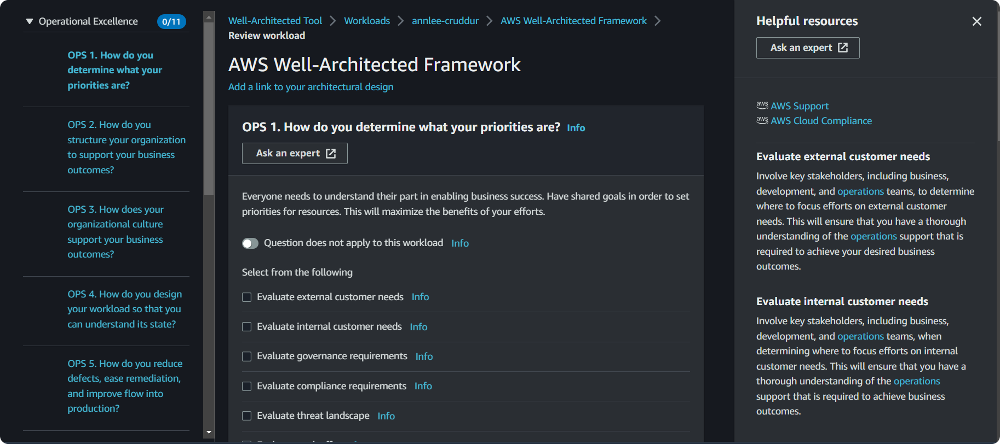

## Architectural Diagram

### [Lucid Chart](https://lucid.app/)

An online diagramming tool that's used in this boot camp to create the diagrams. Has a limited free tier option.

_Other diagramming tools, guides, and AWS assets can be found here [AWS Architecture Icons](https://aws.amazon.com/architecture/icons/)_

**Adding AWS Icons**: Open a new document → Import Data → Shapes → Select _AWS Architecture 2021_ (from Standard Libraries) → Use Selected Shapes.

**Working with Lucid Charts**:


- Shapes sections contain a complete list of icons; use search to quickly locate icons.
- The toolbar contains all of the standard text and shape formatting tools.
- A document can contain multiple sheets.
- A page area to create diagrams.
  - **Enable Infinite Canvas**:  Right click on page area → page settings → toggle Infinite canvas
  - **Enable Line Jumps**:   Right click on page area → page settings → Line Settings → Show Line Jumps


### Create Conceptual Design

Create a conceptual design or napkin design for the project.


I customized the conceptual diagram by adding systems to suggest follow users and a trending topic page.

### Create a Logical Design

- Create a logical design using AWS icons, making sure to keep the designs consistent.
- For the [**Momento**](https://www.gomomento.com/) icon, go to the official website and inspect the website for the icon SVG code.
- Save the code as `filename.svg` using VScode.
- When importing to Lucid, the icon fill color may not appear, so import the SVG file inside [Figma](https://www.figma.com/) and then save it (This will fix any issue with the icon).
- **To import icon**: Import Data → Shapes → Import Shapes → Add to new library → Choose SVG file
- Use the icons to create a logical diagram.

**Logical Design**


**[Lucid Chart Design File Link ](https://lucid.app/lucidchart/1c59d211-6a78-496e-bb86-1db0faf0f6a1/edit?viewport_loc=-1416%2C111%2C3751%2C1823%2Cyv5w6~Ut2Wm0&invitationId=inv_27a0a80d-9325-4670-b7ec-59ff707f157e")**

I've included a serverless trending topic suggestion system that runs at regular intervals, sorts trending topics by the most popular, and then updates the trending page. This is a feature I frequently use on Twitter, so why not include it here?

---

## Security Considerations

Cyber security's goal in an organization is to identify and inform any technical risks.  

- Protect data, applications, and services associated with the cloud.
- Reduce the impact of a breach and human errors.
- Always stay up-to-date on things happening in tech.

## Adding MFA

- Root user is the most powerful user in an AWS account so it's of the highest priority to secure this account.
- MFA provides a second layer of protection.
- To set MFA → profile → security credentials → set MFA
- Also add MFA to the IAM user account.


## Organization Unit

- Lets you manage everything centrally.
- Lets you create multiple, segregated accounts within an AWS account.
- There is no cost to AWS organizations.

**Create OU(s)**  

- Go to the AWS Organizations console and begin creating OUs within the root. When doing so, make sure to name and tag them.
- You have permission to rename, delete, move OU(s), nested OU(s).
- In most organizations, OU(s) are created and designated as standby OU(s) so that they can be assigned more quickly.

<p></p>

## AWS Cloud Trail

>Auditing service from AWS

<p></p>

- Records most of the API calls to your AWS account
- Can be used to monitor data security, auditing, etc.

**Create Cloud Trail**

I created a Trail using the tutorial and then deleted it. I also deleted the KMS (to avoid paying for customer-managed KMS) and the S3 bucket.


## IAM User

User with lesser permission than the root user. It's advised to create an IAM user and leave the root user only for management-related work.

> Principle of least privilege.

**Create IAM User**

- From IAM add the user.
- Add the user to a group and tag.
- Set MFA and Access Keys (for accessing AWS through CLI).

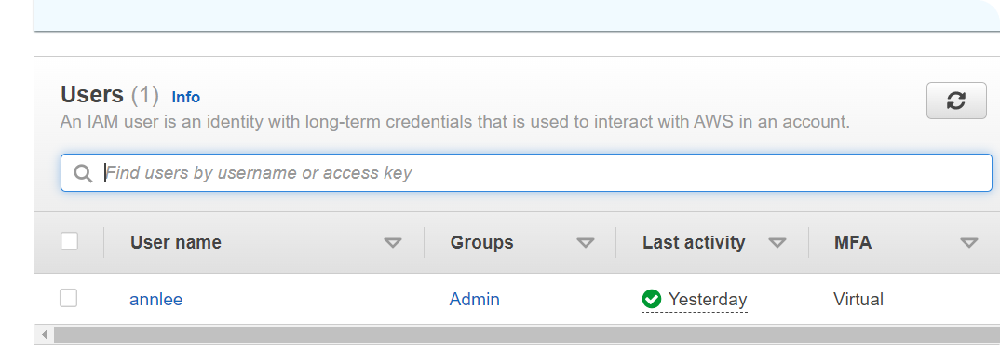

## Roles & Policies

- Role is a type of IAM identity that can be authenticated and authorized to utilize an AWS resource.
  - Role is specifically used to assign to an entity.  

- Policy defines the permissions of the IAM identity.
  - Policy applies to both a role and users/group.

**Create Role**

- From IAM left pane select roles.
- For the time being, select AWS Services and EC2 when creating a new role.
- Select _AdministratorAccess_ policy (gives all admin access).

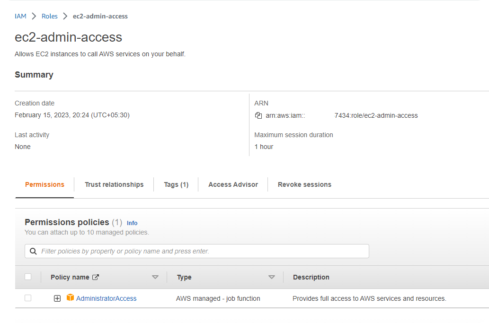

**Attach Policy**

- From IAM left pane select policies.
- Select _SecurityAudit_ (read-only policy) policy and attach it to a role or a user group.
- Another policy that can be attached is AmazonEC2FullAccess (only EC2 access).

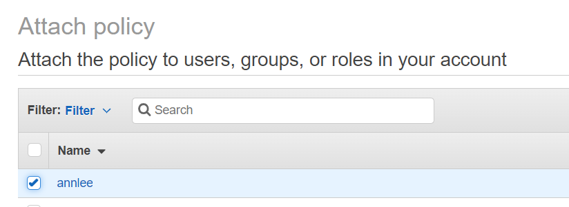

## Service control policies (SCPs)

> A type of organization policy that you can use to manage permissions in your organization.

[SCP](https://docs.aws.amazon.com/organizations/latest/userguide/orgs_manage_policies_scps.html)

There are AWS-managed and customer-managed SCP policies

- SCPs can also be created

**SCP walkthrough**

- Search for SCP and go to the features tab and select **Service control policies (SCPs)**
- or go to IAM and then to SCP
- or through OU


- To prevent users from leaving an OU, create a new SCP policy and include this JSON file.

```bash
{
    "Version": "2012-10-17",
    "Statement": [
        {
            "Effect": "Deny",
            "Action": [
                "organizations:LeaveOrganization"
            ],
            "Resource": "*"
        }
    ]
}
```

- SCP can be attached/detached from an account.

## Top 5 Security Best Practices

- Data Protection & Residency in accordance with Security Policy
- Identity & Access Management with the Least Privilege
- Governance & Compliance of AWS Services being used
  - Global vs Regional Services
  - Compliant Services
- Shared Responsibility of Threat Detection
- Incident Response Plans to include Cloud

---

## Spend Considerations

> Different services have different costs and the cost of each service varies based on the region.

View cost and services that are currently running.

- Profile → Billing Dashboard → Bills (left pane)

Free tier usage.

- Profile → Billing Dashboard → Free tier (left pane)

## CloudWatch Alarm

>Notifies when the cost threshold is exceeded.

Manage Billing Alerts is an old method for alerting about spending; the newer one is budgets.

10 alarms are free under the free tier.


## Budget

Notifies when  

1) your actual spending reaches 85%
2) your actual spending reaches 100%
3) if your forecasted spend is expected to reach 100%

2 budgets for free under the free tier.


## Cost allocation tags

- Profile → Billing Dashboard → Cost allocation tags (left pane)
- Tagging will aid in calculating the cost of a system with multiple services that are all tagged by a single tag.


## Cost Explorer

- Profile → Billing Dashboard → Cost Explorer (left pane)
- Spend can be viewed using various filters such as date, frequency, region, tag, services, and so on.
- View reports and other features.

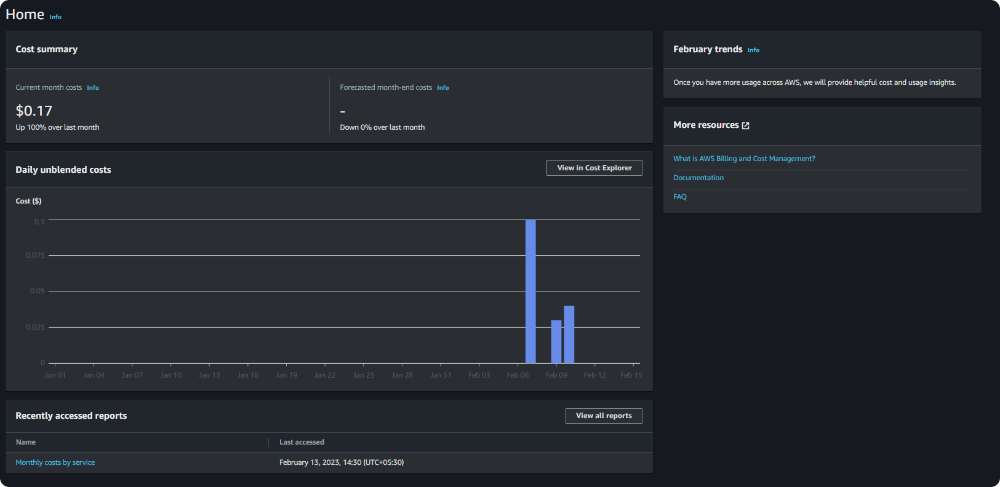

## AWS Credit

To redeem credits, view the credit balance.

- Profile → Billing Dashboard → Credits (left pane)

Certain credit is only applicable to a few services.

## AWS estimates calculator

[https://calculator.aws/](https://calculator.aws/)

- Calculate the estimated cost for different services.
- AWS Calculator provides an estimate based on 730 hrs per month.
- Pricing in real-use cases will vary based on usage.


## AWS Free Tier

To view details related to AWS free tier [https://aws.amazon.com/free](https://aws.amazon.com/free)

- Each service has different types of free options.

---

## AWS Budgets

**Cost Budget**

Already covered [here](#budget).

**Usage Budget**

Budget alert based on usage amount in hours.


**Credit Spent Alert**

Allows you to receive notifications when your credit usage exceeds a certain threshold.


## Create access keys

Access key to send API calls to AWS from CLI, SDKs, or direct API calls. 
Can be created from security credentials under the profile.


## CloudShell

AWS built-in terminal/shell. Only available in selected regions. Can be accessed from the main console by clicking the shell icon.


**AWS CLI auto-prompt**

If enabled, the auto-prompt enables you to use the ENTER key to complete a partially entered command.

- To enable it run `aws --cli-auto-prompt` (only works for a single line).

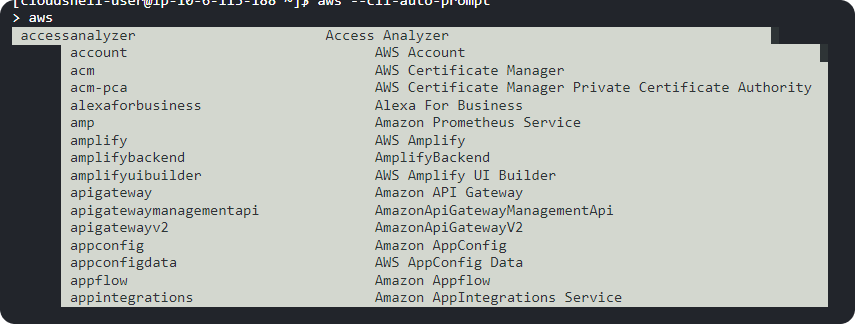

## Install AWS CLI

- Open repo in gitpod.
- `cd..` to go back one folder.
- run AWS CLI install command in terminal.

```bash
curl "https://awscli.amazonaws.com/awscli-exe-linux-x86_64.zip" -o "awscliv2.zip"
unzip awscliv2.zip
sudo ./aws/install
```

- Next step is to run `aws configure` and add the access details, region.
- But for gitpod, since the data outside the workspace is not persistent it can't persist the AWS CLI installation or Access configure so we must perform some additional configurations.

- To make env persistent in gitpod run env variable commands like this  
`gp env VARIABLE_NAME="VALUE"`
  - AWS_ACCESS_KEY_ID="VALUE"
  - AWS_SECRET_ACCESS_KEY="VALUE"
  - AWS_DEFAULT_REGION="VALUE"

- To auto-install AWS CLI add this to `.gitpod.yml` file.

```yaml
tasks:
  - name: aws-cli
    env:
      AWS_CLI_AUTO_PROMPT: on-partial
    init: |
      cd /workspace
      curl "https://awscli.amazonaws.com/awscli-exe-linux-x86_64.zip" -o "awscliv2.zip"
      unzip awscliv2.zip
      sudo ./aws/install
      cd $THEIA_WORKSPACE_ROOT
```

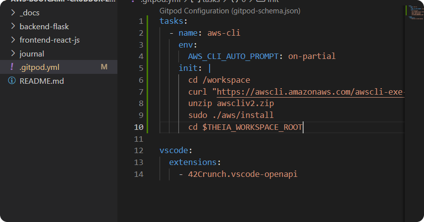

- When the gitpod workspace boots up, it will automatically install AWS CLI and use the previously saved environment variables.


- When we run the AWS command, it will output data specific to our account, as shown below.

```
gitpod /workspace/aws $ aws sts get-caller-identity
{
    "UserId": "AIDAW<REDACTED>",
    "Account": "<REDACTED>7434",
    "Arn": "arn:aws:iam::<REDACTED>7434:user/annlee"
}
```

## Create AWS Budget using AWS CLI

I was able to add a new AWS budget alert using CLI after following the tutorial steps.

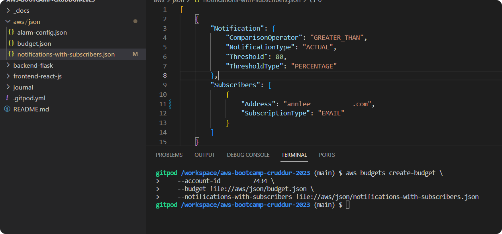


## Create Billing Alarm using AWS CLI

I was able to Create SNS Topic and Add a New AWS Billing Alarm Using CLI by following the tutorial steps.


---

## Homework Challenges


### 1. Adding AWS_CLI_AUTO_PROMPT to .zshrc

I added AWS_CLI_AUTO_PROMPT to the ZSH shell and exported it to `~/.zshrc` so that it auto-runs every time I launch ZSH on my local machine

- `nvim ~/.zshrc`
- Add this line `export AWS_CLI_AUTO_PROMPT="on-partial"` to the end of the `.zshrc` file
- run `source ~/.zshrc`

**Reference:**  
[AWS Docs - AWS_CLI_AUTO_PROMPT](https://docs.aws.amazon.com/cli/latest/userguide/cli-configure-envvars.html#envvars-list-aws_cli_auto_prompt)

### 2. CI/CD Pipeline


**[Link to lucid charts](https://lucid.app/lucidchart/fc60068a-37cb-46c7-a46f-49b174b434fa/edit?viewport_loc=-277%2C-352%2C2502%2C1216%2C0_0&invitationId=inv_aaafa779-b369-484b-9736-87d5d365967b)**

My take on a CI/CD pipeline for Cruddur.

- Developer pushes changes to the github repo.
- GitHub actions test and builds the application.
- Stores container image in ECR.
- Deploy the application using AWS CodeDeploy.

**Reference:**  
[Integrating with GitHub actions](https://aws.amazon.com/blogs/devops/integrating-with-github-actions-ci-cd-pipeline-to-deploy-a-web-app-to-amazon-ec2/)  
[Automated software delivery using Docker Compose and Amazon ECS](https://aws.amazon.com/blogs/containers/automated-software-delivery-using-docker-compose-and-amazon-ecs/)

### 3. Use EventBridge to hookup Health Dashboard to SNS

>This EventBridge configuration monitors all EC2 events and alerts you if there is a problem.

**Using Console**

- Create an SNS topic
- Go to **AWS Health Dashboard**
- Click on **Amazon EventBridge rule Configure**
- Give a name and description
- Keep the default values for **Event bus** and **Rule type**, and then choose **Next**.
- Under **Event pattern**, for **Event source**, choose **AWS services**.
- Under **Event pattern**, for **AWS service**, choose **Health**.
- For **Event type,** choose **Specific Health events**
- choose **Specific service(s)**
- Fill up the rest as shown in the image

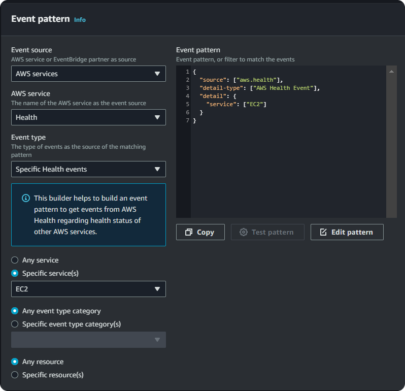

- Choose **Any resource** to create a rule that applies to all resources.
- Choose **Next**
- On the **Select target(s)** page, choose AWS service, select a target ⇒ SNS topic and topic ⇒ set to the topic you created earlier


- Choose **Next**.
- Add tags
- **Review and create**


**Using AWS CLI**

- To create an SNS topic run this command.

 ```bash
 aws sns create-topic --name eventbridge-alert
 ```

- Make sure to copy the SNS topic ARN that's returned as a response.
- To subscribe to an SNS topic, run this command, replacing 'arn' with the ARN of the SNS topic, and don't forget to include the email address.

```
aws sns subscribe \
--topic-arn arn:aws:sns:<REGION>:<ACCOUNT ID>:eventbridge-alert \
--protocol email \
--notification-endpoint <EMAIL>
```

- The CLI steps for configuring billing alarms are similar to this one. Confirm your subscription in your email client.
- This is what the SNS Console looks like.


- To create EventBridge Rule create `eventbridge-sns.json` file inside `aws/json/` folder and add this JSON code.

```json
{
    "source": ["aws.health"],
    "detail-type": ["AWS Health Event"],
    "detail": {
        "service": ["EC2"]
    }
}
```

I got this JSON code by following the event pattern setup I did during the manual configuration.

- Run this command to create an event rule.

```bash
aws events put-rule --name "eventbridge-sns-health" \
--event-pattern file://aws/json/eventbridge-sns.json
```

- This is the response that I got.


- This is how it looks in the EventBridge console.

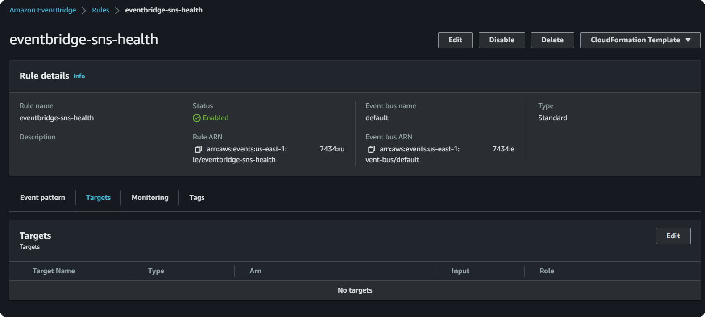

- Now to add the target SNS I ran this command.

```bash
aws events put-targets --rule eventbridge-sns-health --targets "Id"="1","Arn"="arn:aws:sns:us-east-1:<REDACTED>7434:eventbridge-alert"
```


I received the above response; at first, I thought the command had failed, but everything appeared to be fine in the console. So I deleted the eventbridge rule and reran the command. Making sure to check before and after connecting target.  

When an SNS topic is added, the console looks like this.

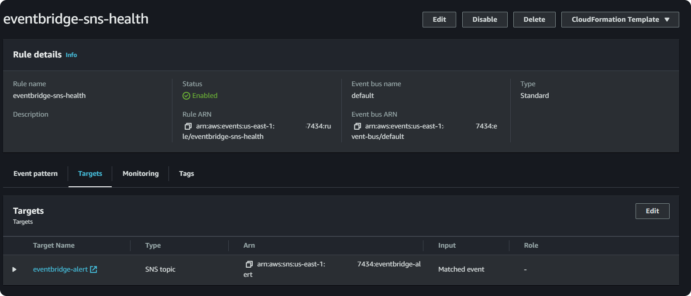

So I guess it's configured correctly, and maybe that response status meant nothing went wrong.

**Reference:**  
[Creating event bridge events rule for aws health](https://docs.aws.amazon.com/health/latest/ug/cloudwatch-events-health.html#creating-event-bridge-events-rule-for-aws-health)  
[Event put-rule](https://awscli.amazonaws.com/v2/documentation/api/latest/reference/events/put-rule.html)  
[Detect and Notify on AWS Personal Health Dashboard Events](https://asecure.cloud/a/detect-aws-health-events/)

### 4. Serverless Notification API

**Serverless Notification API** is a serverless notification API created with Lambda and SNS that sends an email notification to the subscriber whenever a POST request with a name and message is sent to the Lambda function URL.


**[Link to lucid charts](https://lucid.app/lucidchart/fc60068a-37cb-46c7-a46f-49b174b434fa/edit?viewport_loc=-703%2C-222%2C2502%2C1216%2C_U8xkCluicMA&invitationId=inv_aaafa779-b369-484b-9736-87d5d365967b)**

**Testing Lambda Function POST request**

- I created a Lambda function with Python 3.9 runtime.
- When creating make sure to **Enable function URL** from advanced settings and set **Auth type** to **NONE**.


- I won't be dealing with URL authentication for the time being.
- Replaced Lambda function template code with this one.

```python
import json

def lambda_handler(event, context):
    body = json.loads(event.get("body"))
    return {
        'statusCode': 200,
        'body': json.dumps(f"{body['num1']} and {body['num2']}")
    }
```

- Deployed and copied the function URL.
- Send this curl request using Insomnia or another API development platform. Replace the URL with the _Lambda function URL_.

```bash
curl -X POST \
    'https://abcdefg.lambda-url.us-east-1.on.aws/' \
    -H 'Content-Type: application/json' \
    -d '{"num1": "10", "num2": "10"}'
```

- So the POST request via Function URL works


**Creating Notification API**

- Create a SNS topic and subscribe.

```bash
aws sns create-topic --name notification-api
```

- Copy SNS Topic ARN

```bash
aws sns subscribe \
--topic-arn arn:aws:sns:<REGION>:<ACCOUNT ID>:notification-api \
--protocol email \
--notification-endpoint <EMAIL>
```

- Confirm subscription

To allow SNS access to the Lambda function

- Go to Lambda Function → **Configuration → Permissions → Click Role name link**
- Under **Permissions → Add Permission → Attach Policies**
- Filter out **AmazonSNSFullAccess** and add it

Go back to Lambda Function

- Change the Lambda Function code to this, update the SNS ARN, and deploy.

```python
import json
import boto3

def lambda_handler(event, context):
    
    client = boto3.client('sns')
    snsArn = 'arn:aws:sns:<REGION>:<ACCOUNT ID>:notification-api'
    
    body = json.loads(event.get("body"))
    
    
    response = client.publish(
        TopicArn = snsArn,
        Message = body.get("message"),
        Subject= f"Hello {body['name']}"
    )
    
    return {
      'statusCode': 200,
      'body': json.dumps(response)
   }
```

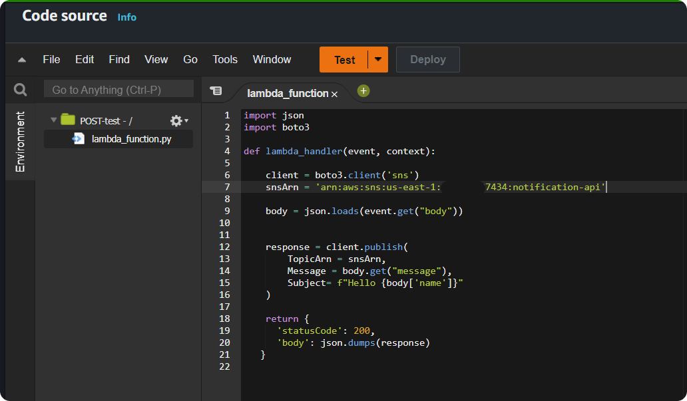

- Send this POST request

```bash
curl --request POST \
  --url https://szsbz<REDACTED>.lambda-url.us-east-1.on.aws/ \
  --header 'Content-Type: application/json' \
  --data '{"name": "Annlee", "message": "This is a test message"}'
```


- Check email client to view SNS email.


SNS was not sending messages to subscribers for some reason during initial testing, so I deleted that topic and created a new one. Everything worked perfectly this time.

**Reference:**  
[Lambda Function URL](https://docs.aws.amazon.com/lambda/latest/dg/urls-tutorial.html)  
[SNS.Client.publish](https://boto3.amazonaws.com/v1/documentation/api/latest/reference/services/sns.html#SNS.Client.publish)

### 5 Destroy root account credentials, Set MFA, IAM role

- Created a temporary IAM user, added to admin group that has permission to Billing and AdministratorAccess.

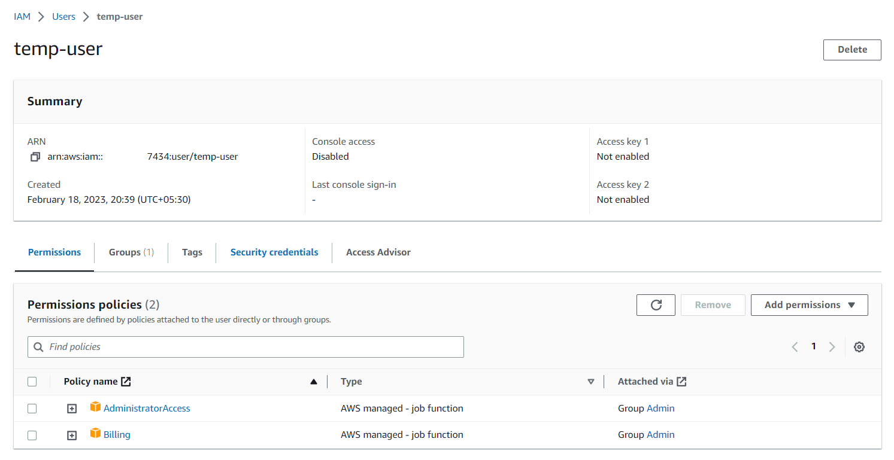

- Set Access Keys.

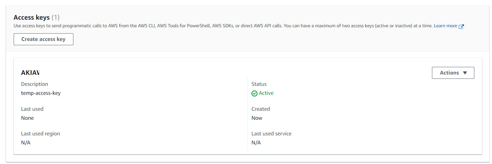

- Set MFA.


- Deleted Root account credentials.


