# Week 1 — App Containerization

## Required Homework

- [Live Stream](#application-containerization)  
- [Containerize Application](#application-containerization)
- [Document the Notification Endpoint](#adding-openapi-endpoint)
- [Backend Endpoint for Notifications](#define-endpoint-in-backend)
- [React Page for Notifications](#react-frontend-for-notifications)
- [DynamoDB Local Container](#dynamodb-local)
- [Postgres Container](#postgres)

## [Homework Challenges](#homework-challenges-1)

- [Updated `.gitpod.yml`](#updated-gitpodyml-to-auto-npm-i)
- [Fundamentals of YAML, OpenAPI & Docker](#learned-fundamentals-of-yaml-openapi--docker)
- [Run the Dockerfile CMD as an external script](#run-the-dockerfile-cmd-as-an-external-script)
- [Running container on local machine](#running-container-on-local-machine)
- [Best practices of Dockerfiles](#best-practices-of-dockerfiles)
- [Multi-Stage Docker Build](#multi-stage-docker-build)
- [Health check in Docker Compose](#health-check-in-docker-compose)
- [Push and tag image to DockerHub](#push-and-tag-a-image-to-dockerhub)
- [Launch Docker Container on EC2](#launch-docker-container-on-ec2)

---

## Application containerization

Makes it more portable i.e., can be deployed on different systems without worrying about dependency issues.

Various community-managed application container images that adhere to best practices → [https://www.linuxserver.io/](https://www.linuxserver.io/)

### Dockerhub

[https://hub.docker.com/](https://hub.docker.com/)

Container registry provided by docker where you can host container images for free.

Similar to how Github is for code, Dockerhub is for docker images.

### OCI (Open Container Initiative)

[https://opencontainers.org/](https://opencontainers.org/)

- Standard guidelines for building images and registries.
- Docker is OCI compliant service.

## Backend

- Create a file `Dockerfile` here: `backend-flask/Dockerfile`
- Add the following docker configuration code to the file.

```docker
FROM python:3.10-slim-buster

# Inside container
# make a new directory and move into it
WORKDIR /backend-flask

# local -> inside container
# copy local requirements.txt to inside container
COPY requirements.txt requirements.txt

# install dependencies listed in requirements.txt inside the container
RUN pip3 install -r requirements.txt

# copy contents from current local directory to inside container
COPY . .

# set env variables inside container and will remain when container is running
ENV FLASK_ENV=development

#TODO
EXPOSE ${PORT}

# CMD -> command
# Run shell command to run flask app

CMD [ "python3", "-m" , "flask", "run", "--host=0.0.0.0", "--port=4567"]
```

- In `Dockerfile` each line is instructions to setup a docker image layer by layer.
- `FROM python:3.10-slim-buster` → get python image from local/dockerhub.
- Docker file uses another docker file to build image ( I like to call this **Dockerception**)
- `WORKDIR /backend-flask` → create this folder in container and move into it.
- `COPY requirements.txt requirements.txt` → Copy `requirements.txt` from local to docker container.
- `RUN pip3 install -r requirements.txt` → install dependencies listed in requirement.txt inside the container.
- `COPY . .` → Copy everything in the current directory to the docker container.
- `ENV FLASK_ENV=development` → set env variables inside container.
- `CMD [ "python3", "-m" , "flask", "run", "--host=0.0.0.0", "--port=4567"]` → shell command to launch the flask application.
- Difference b/w RUN and CMD.

    | RUN | CMD |
    | --- | --- |
    | Used to add a layer to an image. | The command that the container will execute when it boots up |
    | Install libraries, dependencies |  |
    | For example run : apt install htop |  |
- Difference b/w Container and Virtual Machine


### Running Backend locally

```bash
cd backend-flask
export FRONTEND_URL="*"
export BACKEND_URL="*"
python3 -m flask run --host=0.0.0.0 --port=4567
```

- `-m` → module (specifying to use flask module)
- `--host=0.0.0.0` → Binding to 0.0.0.0, expose an application outside the scope of the env we are running. 0.0.0.0 → everything address (needed when running containers)
- `--port=4567` → start on this port.
- Unlock the link for port 4567 in Ports. A green dot before the port indicates that it is currently active.


- To view JSON data, open the link and append `/api/activities/home`

### Build Backend Container Image

- From root directory execute this command to build docker image.

    ```bash
    docker build -t  backend-flask ./backend-flask
    ```

  - `-t` → tag : name
  - `backend-flask` →  docker image name
- Downloads dependencies and creates layers for container image.

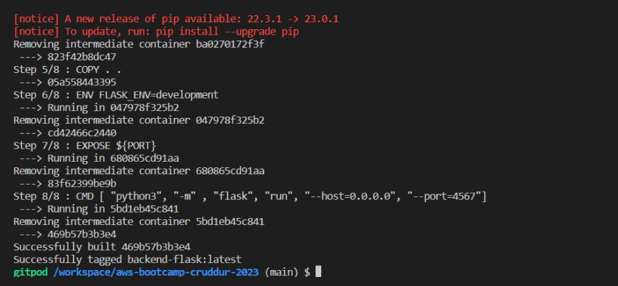

### Run Backend Container

- To run the docker container backend-flask

    ```bash
    docker run --rm -p 4567:4567 -it backend-flask
    ```

  - `--rm` → automatically clean up the container and remove the file system when the container exits.
  - `--it` → is short for --interactive + --tty. Running docker with this command it takes you straight inside the container.  
  - `-d` → run in detached mode/ run in background:


         docker container run --rm -p 4567:4567 -d backend-flask
        

- To run the container with the environment variables set use `-e` .

```bash
# passing env value in same line
docker run --rm -p 4567:4567 -it -e FRONTEND_URL='*' -e BACKEND_URL='*' backend-flask

#OR

# passing env value that you have already set in your local machine
docker run --rm -p 4567:4567 -it  -e FRONTEND_URL -e BACKEND_URL backend-flask
```

- Unlock and open link and go to home URL


## Frontend

```bash
cd frontend-react-js
npm i #install node dependencies
```

- Create a `Dockerfile` file here: `frontend-react-js/Dockerfile`

```docker
FROM node:16.18

ENV PORT=3000

COPY . /frontend-react-js
WORKDIR /frontend-react-js
RUN npm install
EXPOSE ${PORT}
CMD ["npm", "start"]
```

### Running Frontend locally

- set env `REACT_APP_BACKEND_URL="*"`
- To run frontend locally -  `npm start`
- Go to ports, unlock, and then click the frontend link.

### Build Frontend Container Image

- From root directory execute.

```bash
docker build -t frontend-react-js ./frontend-react-js
```

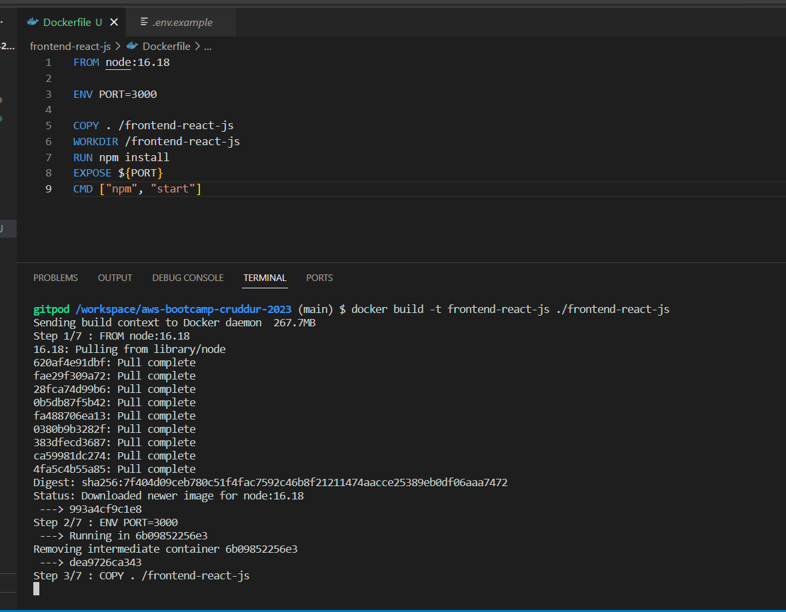

### Run Frontend Container

- To run the frontend-react-js docker container, execute this from the root folder.

```bash
docker run --rm -p 3000:3000 -it -e REACT_APP_BACKEND_URL frontend-react-js

# or 

docker run --rm -p 3000:3000 -it -e REACT_APP_BACKEND_URL="*" frontend-react-js
```

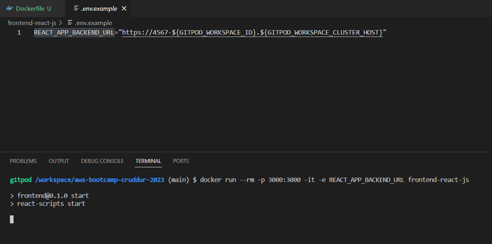

- Click the link under the port tab to launch the frontend.

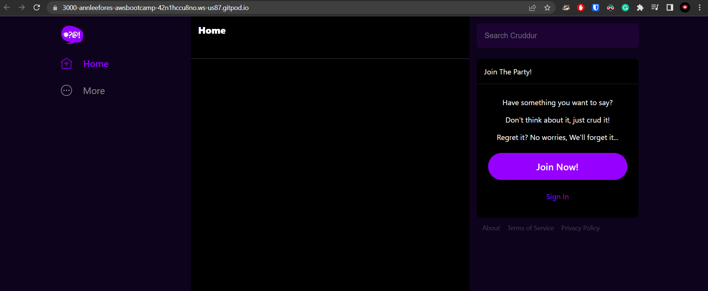

## Useful Docker Commands & Tips

### List containers

- `docker ps` → view running containers.
- `docker ps -a` → to view active and inactive containers

### List Images

- `docker images`
- or click docker extension and then under images.

### Delete an Image

```bash
docker image rm backend-flask --force
```

### Help

- Append any docker command with `--help`

### Container Logs

- From VS code → docker extension. Right click on the running container and click **View Logs.**
- or use shell commands given below.

```bash
docker logs CONTAINER_ID -f
docker logs backend-flask -f
docker logs $CONTAINER_ID -f
```

### Access Container Shell

- From VS Code, right click on running container and click **Access Shell**.
- or Connect to container shell from terminal

```bash
 docker exec CONTAINER_ID -it /bin/bash
```

### Store Container ID in ENV

```bash
CONTAINER_ID=$(docker run --rm -p 4567:4567 -d backend-flask)
```

### Overriding Ports

```bash
FLASK_ENV=production PORT=8080 docker run -p 4567:4567 -it backend-flask
```

## Docker Compose - Multiple Containers

> Compose is a tool for defining and running multi-container Docker applications. With Compose, you use a YAML file to configure your application’s services. Then, with a single command, you create and start all the services from your configuration.
>
- Create `docker-compose.yml` at the root of your project.

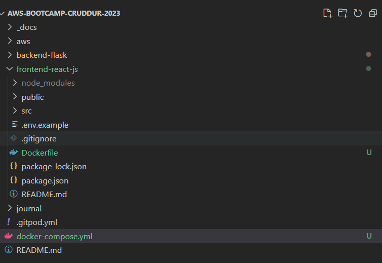

- Paste this YAML code inside `docker-compose.yml` or `compose.yml` file

```yaml
version: "3.8"
services:
  backend-flask:
    environment:
      FRONTEND_URL: "https://3000-${GITPOD_WORKSPACE_ID}.${GITPOD_WORKSPACE_CLUSTER_HOST}"
      BACKEND_URL: "https://4567-${GITPOD_WORKSPACE_ID}.${GITPOD_WORKSPACE_CLUSTER_HOST}"
    build: ./backend-flask
    ports:
      - "4567:4567"
    volumes:
      - ./backend-flask:/backend-flask
  frontend-react-js:
    environment:
      REACT_APP_BACKEND_URL: "https://4567-${GITPOD_WORKSPACE_ID}.${GITPOD_WORKSPACE_CLUSTER_HOST}"
    build: ./frontend-react-js
    ports:
      - "3000:3000"
    volumes:
      - ./frontend-react-js:/frontend-react-js

# the name flag is a hack to change the default prepend folder
# name when outputting the image names
networks: 
  internal-network:
    driver: bridge
    name: cruddur
```

- We pass in the env variable, ports, volumes
- The new `volumes` key mounts the project directory (current directory) on the host to work directory inside the container, allowing you to modify the code on the fly, without having to rebuild the image.
- Launch both frontend and backend container simultaneously while configuring env, mounting, etc → `docker compose up`
- Or right click the `docker-compose.yml` file on VS code and click **Compose Up**

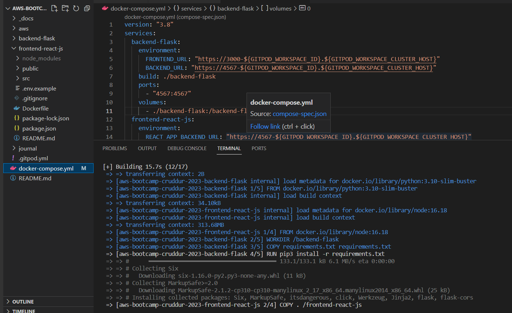

- Go to ports, unlock both, and launch the frontend with data.

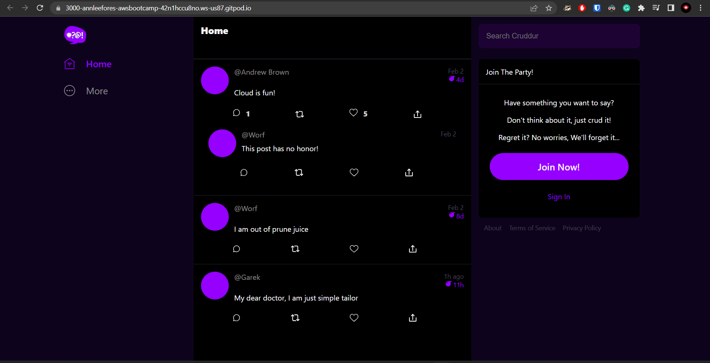

- Because we're using mounted volumes, any changes we make to local code will be reflected in the application running inside Docker - useful for development.
- `docker compose down` → Stops containers and removes containers, networks, volumes, and images created by up
- `docker compose down --volume`  → Remove containers and volume

## DynamoDB local

[Link to Amazon Docs](https://docs.aws.amazon.com/amazondynamodb/latest/developerguide/DynamoDBLocal.DownloadingAndRunning.html)

DynamoDB Local emulates a DynamoDB database in your local environment for rapid development and table design iteration

- Add DynamoDB local setup instructions to `docker-compose.yml`

```bash
dynamodb-local:
    # https://stackoverflow.com/questions/67533058/persist-local-dynamodb-data-in-volumes-lack-permission-unable-to-open-databa
    # We needed to add user:root to get this working.
    user: root
    command: "-jar DynamoDBLocal.jar -sharedDb -dbPath ./data"
    image: "amazon/dynamodb-local:latest"
    container_name: dynamodb-local
    ports:
      - "8000:8000"
    volumes:
      - "./docker/dynamodb:/home/dynamodblocal/data"
    working_dir: /home/dynamodblocal
```

### Working with DynamoDB

- `docker compose up`  to launch Frontend, Backend & DynamoDB
- Create a table

```bash
aws dynamodb create-table \
    --endpoint-url http://localhost:8000 \
  --table-name Music \
    --attribute-definitions \
        AttributeName=Artist,AttributeType=S \
        AttributeName=SongTitle,AttributeType=S \
    --key-schema AttributeName=Artist,KeyType=HASH AttributeName=SongTitle,KeyType=RANGE \
    --provisioned-throughput ReadCapacityUnits=1,WriteCapacityUnits=1 \
    --table-class STANDARD
```


- Create an Item

```bash
aws dynamodb put-item \
    --endpoint-url http://localhost:8000 \
    --table-name Music \
    --item \
        '{"Artist": {"S": "No One You Know"}, "SongTitle": {"S": "Call Me Today"}, "AlbumTitle": {"S": "Somewhat Famous"}}' \
    --return-consumed-capacity TOTAL
```


- List Tables

```bash
aws dynamodb list-tables --endpoint-url http://localhost:8000
```


- Get Data

```bash
aws dynamodb scan --table-name Music --query "Items" --endpoint-url http://localhost:8000
```


Note:

- Add DynamoDB local files to `.gitignore`, so that it doesn’t get committed to Github
- Add this line to `.gitignore`→ `docker/*`

## Postgres

- Add Postgres setup instructions to `docker-compose.yml`

```yaml
db:
    image: postgres:13-alpine
    restart: always
    environment:
      - POSTGRES_USER=postgres
      - POSTGRES_PASSWORD=password
    ports:
      - '5432:5432'
    volumes: 
      - db:/var/lib/postgresql/data
```

- Paste this `Volume` at the end of the `docker-compose.yml` file

```yaml
volumes:
  db:
    driver: local
```

- `driver: local` storing database locally on this machine

### Working with PostgreSQL

- `docker compose up`  to launch Frontend, Backend,  Postgres Server & DynamoDB
- To work with PostgreSQL you need to have a client library to interact with the server.
- And to auto install client library, add this to `.gitpod.yml`

```yaml
- name: postgres
    init: |
      curl -fsSL https://www.postgresql.org/media/keys/ACCC4CF8.asc|sudo gpg --dearmor -o /etc/apt/trusted.gpg.d/postgresql.gpg
      echo "deb http://apt.postgresql.org/pub/repos/apt/ `lsb_release -cs`-pgdg main" |sudo tee  /etc/apt/sources.list.d/pgdg.list
      sudo apt update
      sudo apt install -y postgresql-client-13 libpq-dev
```

- Execute `psql -U postgres --host localhost` to connect the postgres server that’s already running at port `5432`
- Type password (which is password itself) to connect


- `\q` to quit

- To view PostgreSQL install this extension → `cweijan.vscode-postgresql-client2`
  - Add it to `.gitpod.yml` by clicking settings icon

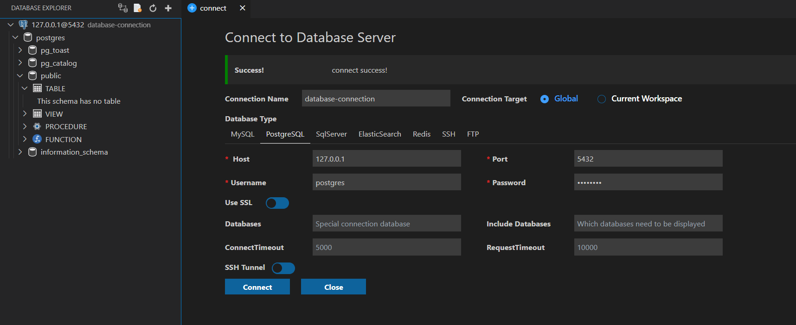

**Note:**

- In the end the docker compose file should look like this [`docker-compose.yml`](media/week1/code/template.docker-compose.yml)  
- Entire .gitpod.yml should look like this [`.gitpod.yml`](media/week1/code/template.gitpod.yml)

## OpenAPI

[https://www.openapis.org/](https://www.openapis.org/)

- Used to visualize and interact with API
- OpenAPI is a standard for defining API
- Open  `openapi-3.0.yml` and click **/API** extension.

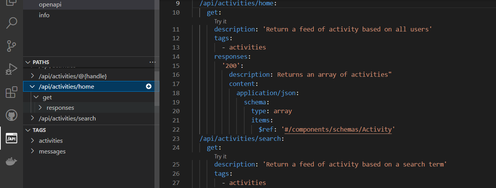

- Lots of services support OpenAPI
- While `openapi-3.0.yml` file is open, click the window with search icon on top right corner to open up the OpenAPI preview window.

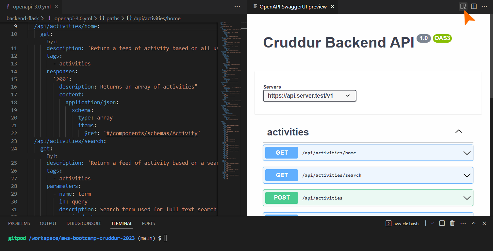

## Signing Up

- Run `npm i` to install node modules if they’re not available in *frontend-react-js* folder and `docker-compose up`
- Sign Up and confirm by typing email and `1234` hard coded confirmation code.

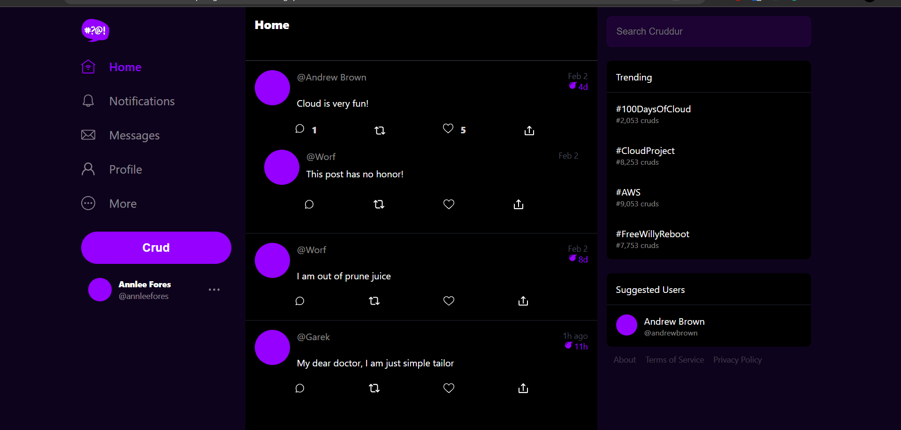

## Notification Feature

### Adding OpenAPI endpoint

- To add an endpoint for notification use the OpenAPI extension to create a new path.

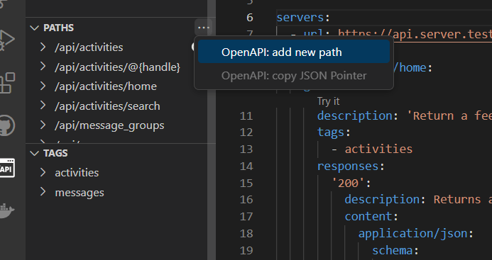

- Edit the new path for notification endpoint.

```yaml
/api/activites/notifications:
    get:
      description: 'Return a feed of activity for all of those that I follow'
      tags:
        - activities
      parameters: []
      responses:
        '200':
          description: Return an array of activities
          content:
            application/json:
              schema:
                type: array
                items:
                  $ref: '#/components/schemas/Activity'
```

- To learn more about openapi.yml → [https://spec.openapis.org/oas/v3.1.0](https://spec.openapis.org/oas/v3.1.0)

### Define endpoint in backend

- Define routes

```python
@app.route("/api/activities/notifications", methods=['GET'])
def data_notification():
  data = NotificationActivities.run()
  return data, 200
```

- Create a file `notification_activities.py` inside `services/`  with this code

```python
from datetime import datetime, timedelta, timezone

class NotificationActivities:
  def run():
    now = datetime.now(timezone.utc).astimezone()
    results = [{
      'uuid': '68f126b0-1ceb-4a33-88be-d90fa7109eee',
      'handle':  'Tron',
      'message': 'I am a character in a movie where human gets inside game.',
      'created_at': (now - timedelta(days=2)).isoformat(),
      'expires_at': (now + timedelta(days=5)).isoformat(),
      'likes_count': 5,
      'replies_count': 1,
      'reposts_count': 0,
      'replies': [{
        'uuid': '26e12864-1c26-5c3a-9658-97a10f8fea67',
        'reply_to_activity_uuid': '68f126b0-1ceb-4a33-88be-d90fa7109eee',
        'handle':  'Worf',
        'message': 'This post has no honor!',
        'likes_count': 0,
        'replies_count': 0,
        'reposts_count': 0,
        'created_at': (now - timedelta(days=2)).isoformat()
      }],
    }
    ]
    return results
```

- Import  `notification_activities.py` inside app.py
- Go to backend link and append `api/activities/notifications` to view response JSON

### React Frontend for notifications

- Open `frontend-react-js` folder
- Add this import statement in App.js

`import NotificationsFeedPage from './pages/NotificationsFeedPage';`

- Add this to `const router = createBrowserRouter([`

```jsx
{
  path: "/notifications",
  element: <NotificationsFeedPage />
},
```

- Go to `pages/` and create `NotificationsFeedPage.js` file and add this content -> [NotificationsFeedPage.js](media/week1/code/template.NotificationsFeedPage.js)

- Can create `NotificationsFeedPage.css` in the same folder if you need to add styling
- Launch frontend, sign in and go to notifications


---

## App Containerization Pricing Considerations

### Gitpod

- Up to 50 hours of usage/month
- Standard : 4 cores, 8GB RAM & 30GB storage
- Avoid spinning up multiple environments at the same time
- If unused Gitpod workspace will close on it’s on

### Github Codespaces

- Up to 60 hours of usage/month with : 2 cores 4 GB RAM and 15 GB of
storage
- Up to 30 hours of usage/month with : 4 cores 8 GB RAM and 15 GB of
storage
- If unused this will also shutdown

### AWS Cloud9

- Covered under free tier until the validity of t2.micro instance in your
account.
- Avoid using Cloud9 in case of free tier instance in use for other purpose

### CloudTrail

- Avoid cloudtrail if under free tier
- Use the free 90 days trail

---

## Docker Container Security Best Practices


### What is Container Security?

Container Security is the practice of protecting your applications hosted on compute services like Containers. Common examples of applications can be Single Page Applications (SPAs), Microservices, APIs etc

### Container Security Components

- Docker & Host Configuration
- Securing Images
- Secret Managements
- Application Security
- Data Security
- Monitoring Containers
- Compliance Framework

### Security Best Practices

- Keep Host & Docker Updated to latest security Patches
- Docker daemon & containers should run in non-root user mode - container escape
- Image Vulnerability Scanning
  - Limit size of docker image
- Trusting a Private vs Public Image Registry
- No Sensitive Data in Docker files or Images
- Use Secret Management Services to Share secrets
- Read only File system and Volume for Docker
- Separate databases for long term storage
- Use DevSecOps practices while building application security
- Ensure all Code is tested for vulnerabilities before production use

### Open Source vulnerability check

- [https://snyk.io/](https://snyk.io/)

#### Test Docker Container
- Create a docker container based on this guide   
[https://docs.docker.com/compose/gettingstarted/](https://docs.docker.com/compose/gettingstarted/)
- Install Snyk CLI  
[https://docs.snyk.io/snyk-cli/install-the-snyk-cli](https://docs.snyk.io/snyk-cli/install-the-snyk-cli)
- Use this Snyk command `snyk container test <container_name>` to test docker image.
- Or use Snyk website.

### Secret Manager

- [AWS Secrets Manager](https://aws.amazon.com/secrets-manager/)

- [Hashicorp Vault](https://www.vaultproject.io/)

### Image Vulnerability Scanning

- [AWS Inspector](https://aws.amazon.com/inspector/)

- [Clair](https://github.com/quay/clair)

### Running Containers in AWS

- Problem with docker is that every time there’s need to make change you have to stop the container and docker-compose is limited to only building one application and it has many limitations.
- Solution is to use managed container services like
  - AWS EKS - Elastic Kubernetes Service
  - AWS ECS - Elastic Container Service
  - AWS Fargate - Serverless Service
  - AWS App Runner
  - AWS CoPilot

---

## Homework Challenges

I completed the majority of the homework challenges on my local machine rather than using up gitpod credits.

### Updated `.gitpod.yml` to auto `npm i`

```yaml
tasks:
  - name: aws-cli
    env:
      AWS_CLI_AUTO_PROMPT: on-partial
    init: |
      cd /workspace
      curl "https://awscli.amazonaws.com/awscli-exe-linux-x86_64.zip" -o "awscliv2.zip"
      unzip awscliv2.zip
      sudo ./aws/install
      cd $THEIA_WORKSPACE_ROOT
  
  - name: postgres
    init: |
      curl -fsSL https://www.postgresql.org/media/keys/ACCC4CF8.asc|sudo gpg --dearmor -o /etc/apt/trusted.gpg.d/postgresql.gpg
      echo "deb http://apt.postgresql.org/pub/repos/apt/ `lsb_release -cs`-pgdg main" |sudo tee  /etc/apt/sources.list.d/pgdg.list
      sudo apt update
      sudo apt install -y postgresql-client-13 libpq-dev
      exit

  - name: npm-install
    init: |
      cd /workspace/aws-bootcamp-cruddur-2023/frontend-react-js
      npm i
      exit

vscode:
  extensions:
    - 42Crunch.vscode-openapi
    - cweijan.vscode-postgresql-client2
```

### Learned fundamentals of YAML, OpenAPI & Docker

- I learned the fundamentals of YAML by using [online resources](https://youtu.be/1uFVr15xDGg).
- I read the [openAPI documentation](https://spec.openapis.org/oas/v3.1.0) to learn more about it. I'm going to start using openAPI in my other projects.
- I used [Adrian Cantrill’s Docker course](https://learn.cantrill.io/p/docker-fundamentals) to refresh my docker knowledge.

### Run the Dockerfile CMD as an external script

One advantage of having an external script handle bash commands is that we can run multiple commands, whereas Dockerfile only allows us to run one.

#### Backend

- I updated the Dockerfile to make a script executable and run it at the end.

```docker
FROM python:3.10-slim-buster

WORKDIR /backend-flask

COPY requirements.txt requirements.txt

RUN pip3 install -r requirements.txt

COPY . .

ENV FLASK_ENV=development

EXPOSE ${PORT}

RUN chmod +x ./script.sh

CMD ["/bin/bash", "./script.sh"]
```

- In the same folder, I created a `script.sh` file and added this bash script to it.

```bash
#!/bin/bash
python3 -m flask run --host=0.0.0.0 --port=4567
```

- Build and ran container.

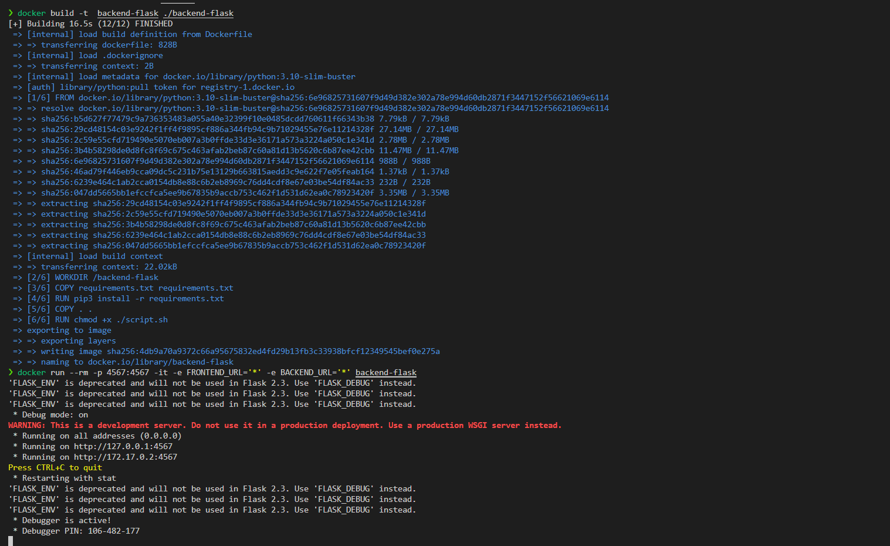

#### Frontend

- I updated the Dockerfile to make a script executable and run it at the end.

```docker
FROM node:16.18

ENV PORT=3000

COPY . /frontend-react-js
WORKDIR /frontend-react-js
RUN npm install
EXPOSE ${PORT}

RUN chmod +x ./script.sh

CMD ["/bin/bash", "./script.sh"]

# CMD ["npm", "start"]
```

- In the same folder, I created a `script.sh` file and added this bash script to it.

```bash
#!/bin/bash
npm start
```

- Build and ran container.

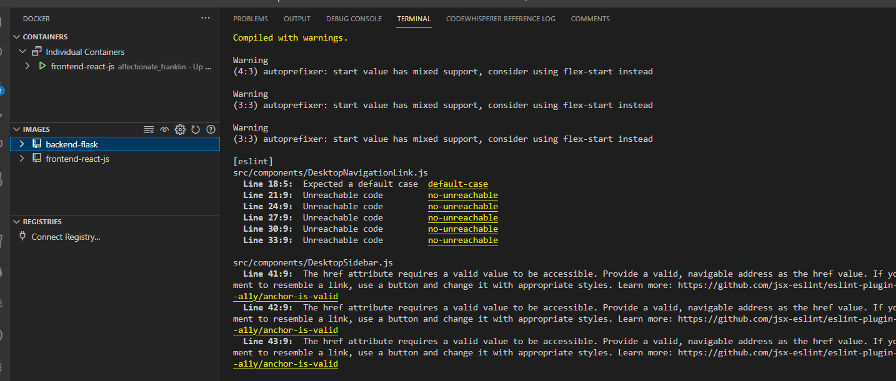

### Running container on local machine

- I already had Docker installed and running on my Windows machine with WSL 2, and after making a few changes to the URL in ENV VARs, I was able to run the containers using Docker compose.


- Docker desktop screenshot

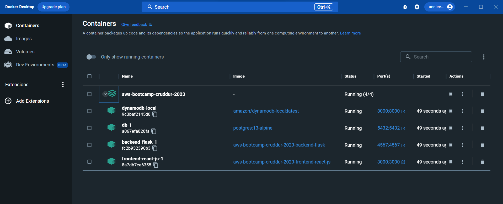

- Connected to locally running PostgreSQL server

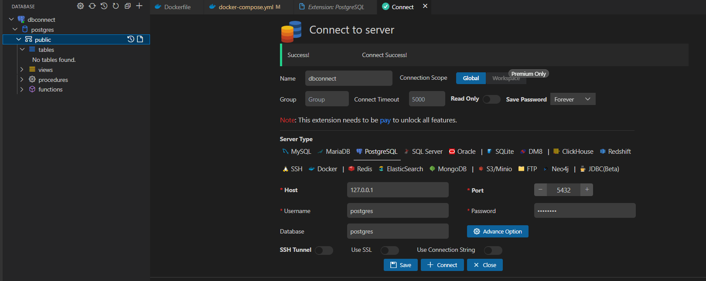

### Best practices of Dockerfiles

- Use Multi-stage Builds
- Order Dockerfile Commands Appropriately
- Use Small Docker Base Images
- Use explicit and deterministic Docker base image tags
- Minimize the Number of Layers by reducing number of `RUN`, `COPY`, and `ADD` commands
- Run containers with least possible privilege (and never as root)
- Prefer COPY Over ADD
- Run Only One Process Per Container
- Include a HEALTHCHECK Instruction
- Use a .dockerignore File
- Lint and Scan Your Dockerfiles and Images

Some of these best practices have been incorporated into the Multi-stage Docker build.

**Reference:**

[https://docs.docker.com/develop/develop-images/dockerfile_best-practices](https://docs.docker.com/develop/develop-images/dockerfile_best-practices/)  
[https://testdriven.io/blog/docker-best-practices](https://testdriven.io/blog/docker-best-practices/)  
[https://snyk.io/blog/10-best-practices-to-containerize-nodejs-web-applications-with-docker](https://snyk.io/blog/10-best-practices-to-containerize-nodejs-web-applications-with-docker/)  
[https://snyk.io/blog/best-practices-containerizing-python-docker](https://snyk.io/blog/best-practices-containerizing-python-docker/)

### Multi-Stage Docker Build

#### Backend

- I chose to stick with `python:3.10-slim-buster` because it provides the best balance of image size and having all required packages - **Use explicit and deterministic Docker base image tags**.
- I’m using `virtualenv` to make it easier to move and isolate packages.- **Separate dependencies from source code**.
- I used two stages for **multi-stage builds**: build image and main image.
- All dependencies are installed and complied during the build image stage.
- The `venv` with dependencies is then copied to the main image in the second stage.
- Using this method, I was able to avoid installing build tools in the main image.
- This is the Dockerfile

```docker
# -----------------build image-----------------
FROM python:3.10-slim AS build

# for compiling packages
RUN apt-get update
RUN apt-get install -y --no-install-recommends \
    build-essential gcc 

WORKDIR /backend-flask

#virtualenv
RUN python3 -m venv /backend-flask/venv
ENV PATH="/backend-flask/venv/bin:$PATH"

# install dependencies
COPY requirements.txt .
RUN pip3 install -r requirements.txt

# --------------main image-------------------
FROM python:3.10-slim-buster

WORKDIR /backend-flask

# copy deps from build image
COPY --from=build /backend-flask/venv ./venv

COPY . .

ENV PATH="/backend-flask/venv/bin:$PATH"

ENV FLASK_ENV=development

EXPOSE ${PORT}

CMD [ "python3", "-m" , "flask", "run", "--host=0.0.0.0", "--port=4567"]
```

- Here is a comparison of  docker images
    
    
    
    - The first one is image with **build tools** - 368MB
    - Second one is image with **multi-stage** and **build tools** - 140MB
    - Third one is normal image **without any build tools** - 129MB
- Multi-stage backend docker container running

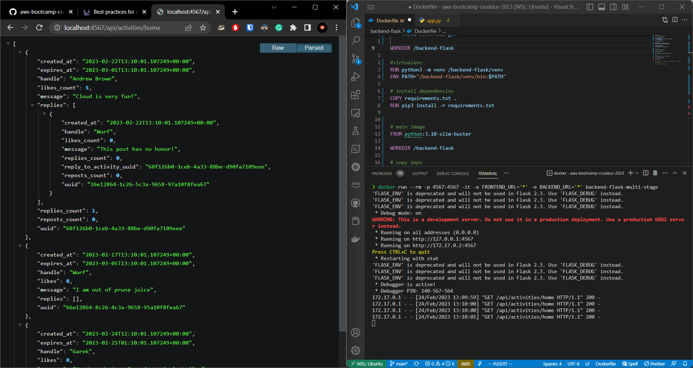

**Reference:**

[https://snyk.io/blog/best-practices-containerizing-python-docker/](https://snyk.io/blog/best-practices-containerizing-python-docker/)  
[https://pythonspeed.com/articles/smaller-python-docker-images/](https://pythonspeed.com/articles/smaller-python-docker-images/)  
[https://pythonspeed.com/articles/multi-stage-docker-python/](https://pythonspeed.com/articles/multi-stage-docker-python/)  
[https://www.reddit.com/r/docker/comments/g5hb93/alpine_vs_pythonslim_for_deploying_python_data/](https://www.reddit.com/r/docker/comments/g5hb93/alpine_vs_pythonslim_for_deploying_python_data/)

#### Frontend

- I chose  `node:16.19.1-bullseye-slim` for the main image because it is significantly lighter than what we previously used and contains all of the required libraries. It was also suggested when I searched for node:16.18 on snyk advisor.
- Replaced `npm install` with  `npm ci --only=production` (production dependencies)
- NODE ENV is set to production for optimal performance and security.
- I used two stages for the multi-stage build, one for the build and one for the main image.
- The build stage makes use of a standard node image. Deps are installed using package. json
- In the second stage, these dependencies are copied over to the main image, which is based on a lighter node image. Other application files are also copied.
- I added a `.dockerignore` file to avoid unnecessary files like node_modules, gitignore, and so on.

```docker
node_modules
npm-debug.log
Dockerfile
.git
.gitignore
.npmrc
```

- This is the final Dockerfile

```docker
#--------------build image----------------
FROM node:16.19.1 AS build

WORKDIR /frontend-react-js

# copy only package-lock.json and package.json files
COPY package*.json /frontend-react-js

# production ready npm install
RUN npm ci --only=production

# ------------- main image ---------------000
FROM node:16.19.1-bullseye-slim

# set node env to production
ENV NODE_ENV production
ENV PORT=3000

WORKDIR /frontend-react-js

# copy deps
COPY --from=build /frontend-react-js/node_modules /frontend-react-js/node_modules 
COPY . /frontend-react-js

EXPOSE ${PORT}

CMD ["npm", "start"]
```

- The image size comparison
    
    
    
    - The first image uses multi-stage - **427MB**
    - Second one uses single stage - **1.23GB**
- Multi-stage frontend docker container running


**Reference:**

[https://snyk.io/blog/10-best-practices-to-containerize-nodejs-web-applications-with-docker/](https://snyk.io/blog/10-best-practices-to-containerize-nodejs-web-applications-with-docker/)

I could have further reduced the image size by using an alpine image. However, it is not suitable for production apps and can frequently result in longer build times if compiled binaries that work with it are not available. Also can increase the image size.

### Health check in Docker Compose

- I created an endpoint inside the flask app to check for health (optional)

```python
@app.route("/api/health", methods=["GET"])
def health():
    return "Healthy: OK"
```

- Then, in the second stage of container build, I added instructions for installing curl inside the backend-flask image.
    - Curl was not installing at first, so I had to update and then install it.
        
        ```docker
        # install curl for healthcheck
        RUN sudo apt update && install -y curl
        ```
        
- checking if health check is working locally

```bash
curl http://localhost:4567/api/health

#response from container
root@eaf237f1c734:/backend-flask# curl http://localhost:4567/api/health
Healthy: OK
root@eaf237f1c734:/backend-flask#
```

- Added healthcheck to docker compose under backend

```yaml
ports:
  - "4567:4567"
healthcheck:
  test: curl --fail http://localhost:4567/api/health || exit 1
  interval: 10s
  timeout: 10s
  start_period: 10s
  retries: 3

volumes:
  - ./backend-flask:/backend-flask
```

- `docker compose up` and verify health using `docker ps`
    - When I tried to compose, I received this error.
    
    ```yaml
    failed to solve: rpc error: code = Unknown desc = failed to solve with frontend dockerfile.v0: failed to create LLB definition: failed to authorize: rpc error: code = Unknown desc = failed to fetch oauth token: Post "https://auth.docker.io/token": EOF
    ```
    
    - A quick Google search revealed that I needed to re-login to resolve this.
- Then I got this error `/usr/local/bin/python3: No module named flask` and flask isn’t running
    - My best guess is that this is due to virtualenv, and because we're using bind mounts, it's looking for the same path on the host machine.
    - I attempted to set up a venv on a local machine, but that did not resolve the problem.
    - When I added this venv, the normal docker run for the backend failed as well; this was resolved by adding the venv to `.dockerignore`.
    - I'll look into resolving this path issue later because it was taking up too much of my time.

- I setup health check on frontend app following the same steps and pinging to the frontend main domain.


- Health status

```bash
CONTAINER ID   IMAGE                                         COMMAND                  CREATED          STATUS                    PORTS                                       NAMES
a95f9d8dcd4f   aws-bootcamp-cruddur-2023-backend-flask       "python3 -m flask ru…"   15 seconds ago   Up 14 seconds (healthy)   0.0.0.0:4567->4567/tcp, :::4567->4567/tcp   aws-bootcamp-cruddur-2023-backend-flask-1
a435a8ba6334   postgres:13-alpine                            "docker-entrypoint.s…"   15 seconds ago   Up 14 seconds             0.0.0.0:5432->5432/tcp, :::5432->5432/tcp   aws-bootcamp-cruddur-2023-db-1
06cc3cb142f2   amazon/dynamodb-local:latest                  "java -jar DynamoDBL…"   15 seconds ago   Up 14 seconds             0.0.0.0:8000->8000/tcp, :::8000->8000/tcp   dynamodb-local
b1bad4fe7ccc   aws-bootcamp-cruddur-2023-frontend-react-js   "docker-entrypoint.s…"   15 seconds ago   Up 14 seconds (healthy)   0.0.0.0:3000->3000/tcp, :::3000->3000/tcp   aws-bootcamp-cruddur-2023-frontend-react-js-1
```


**Reference:**

[https://snyk.io/blog/best-practices-containerizing-python-docker/](https://snyk.io/blog/best-practices-containerizing-python-docker/)  
[https://testdriven.io/blog/docker-best-practices/#include-a-healthcheck-instruction](https://testdriven.io/blog/docker-best-practices/#include-a-healthcheck-instruction)

### Push and tag a image to DockerHub

- Build frontend and backend container image.
- Tagged images.

```bash
docker tag <image_id> <username>/<repo_name>:<tag>
```

```bash
❯ docker images
REPOSITORY                      TAG       IMAGE ID       CREATED         SIZE
annleefores/frontend-react-js   1.0       ea8271a68287   2 minutes ago   427MB
frontend-react-js               latest    ea8271a68287   2 minutes ago   427MB
annleefores/backend-flask       1.0       4804f14d80e1   4 minutes ago   164MB
backend-flask                   latest    4804f14d80e1   4 minutes ago   164MB
```

- docker push tagged images.

```bash
docker push <username>/<repo-name>:<tag>
```

- Container images pushed to dockerhub.


[Link to my dockerhub profile](https://hub.docker.com/u/annleefores)

### Launch Docker Container on EC2

- Launch an EC2 instance, set key-pair, Allow HTTP traffic from internet.
- Connect to instance via SSH
- Install docker

```bash
sudo yum update -y && sudo amazon-linux-extras install docker
```

- Start docker service

```bash
sudo service docker start
```

- (Optional) To ensure that the Docker daemon starts after each system reboot, run the following command

```bash
sudo systemctl enable docker
```

- Add current user to docker group to use docker commands without sudo permission

```bash
sudo usermod -a -G docker ec2-user
```

- Log out and log back in
- Incase of error when running `docker info` reboot ec2 instance
- Pull image from dockerhub.

```bash
[ec2-user@ip-172<redacted>5 ~]$ docker images
REPOSITORY                      TAG       IMAGE ID       CREATED             SIZE
annleefores/frontend-react-js   1.0       ea8271a68287   About an hour ago   427MB
annleefores/backend-flask       1.0       4804f14d80e1   About an hour ago   164MB

```

- If not already done, modify the inbound rules to allow ports 3000 and 4567.
- I tried running them separately (make sure to use env vars also its http not https)
- Install docker compose on ec2

```yaml
mkdir -p ~/.docker/cli-plugins/
curl -SL https://github.com/docker/compose/releases/download/v2.16.0/docker-compose-linux-x86_64 -o ~/.docker/cli-plugins/docker-compose
```

```yaml
chmod +x ~/.docker/cli-plugins/docker-compose
```

```yaml
docker compose version
```

- Get the IP address of the instance within ec2 and store it in an environment variable.

```bash
export IP=$(curl http://169.254.169.254/latest/meta-data/public-ipv4)
```

- I made this docker compose file to start them both.

```yaml
version: "3.8"
services:
  backend-flask:
    environment:
      FRONTEND_URL: "http://$IP:3000"
      BACKEND_URL: "http://$IP:4567"
    image: annleefores/backend-flask:1.0
    ports:
      - "4567:4567"

    healthcheck:
      test: curl --fail http://$IP:4567/api/health || exit 1
      interval: 10s
      timeout: 10s
      start_period: 10s
      retries: 3
    
  frontend-react-js:
    environment:
      REACT_APP_BACKEND_URL: "http://$IP:4567"
    image: annleefores/frontend-react-js:1.0
    ports:
      - "3000:3000"

networks: 
  internal-network:
    driver: bridge
    name: cruddur
```

- Backend and frontend running together on ec2 instance

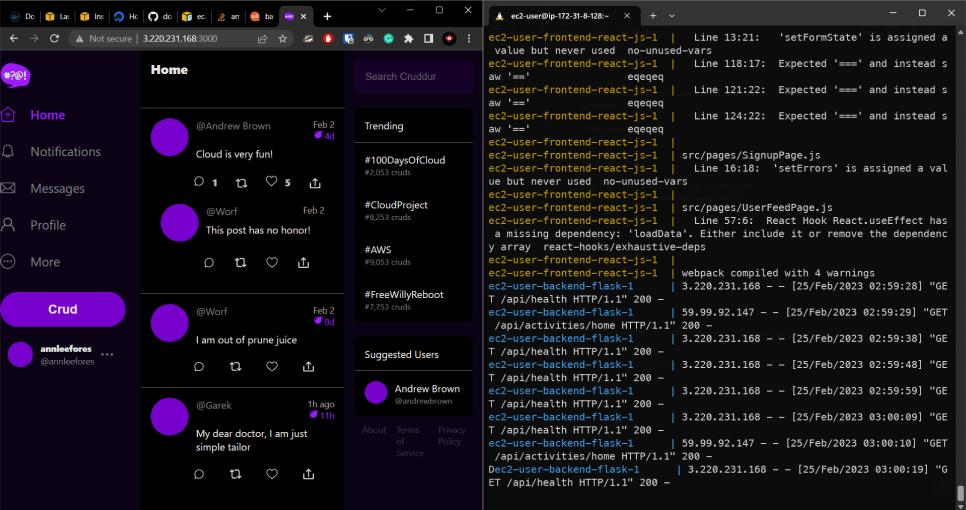

**Reference**

[https://docs.aws.amazon.com/AmazonECS/latest/developerguide/create-container-image.html](https://docs.aws.amazon.com/AmazonECS/latest/developerguide/create-container-image.html)  
[https://github.com/docker/compose](https://github.com/docker/compose)