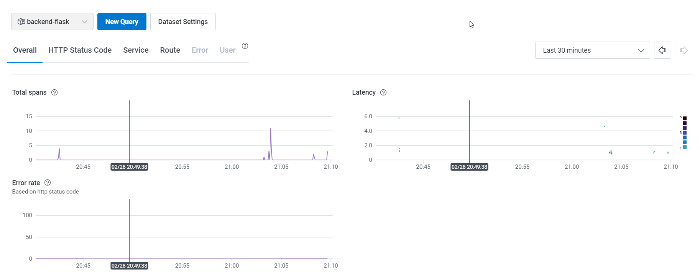
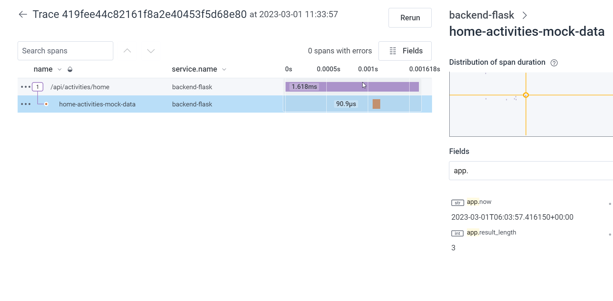
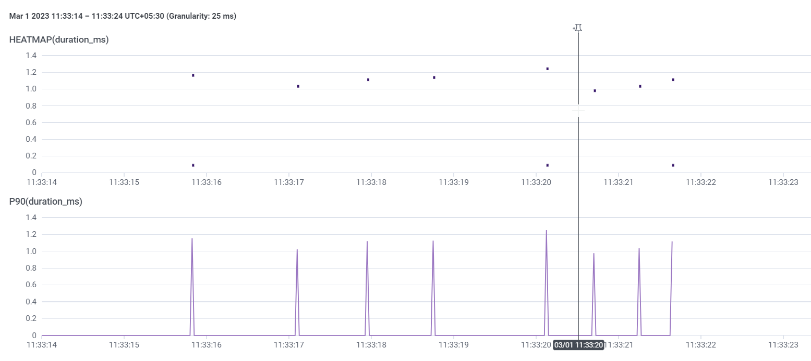
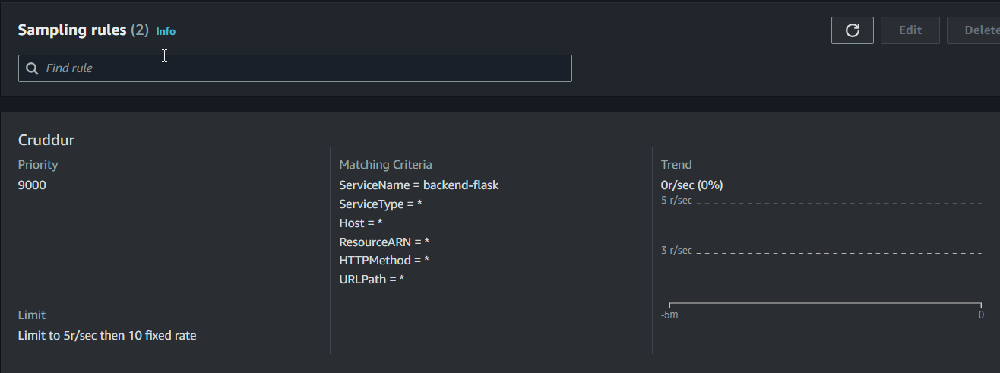
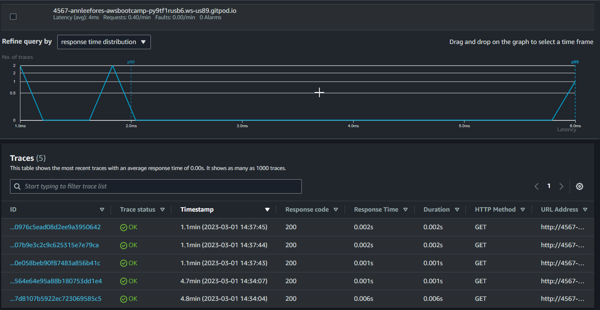
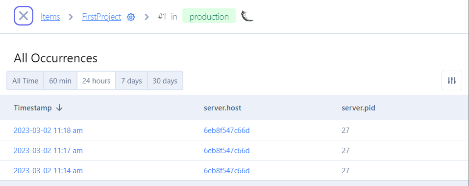
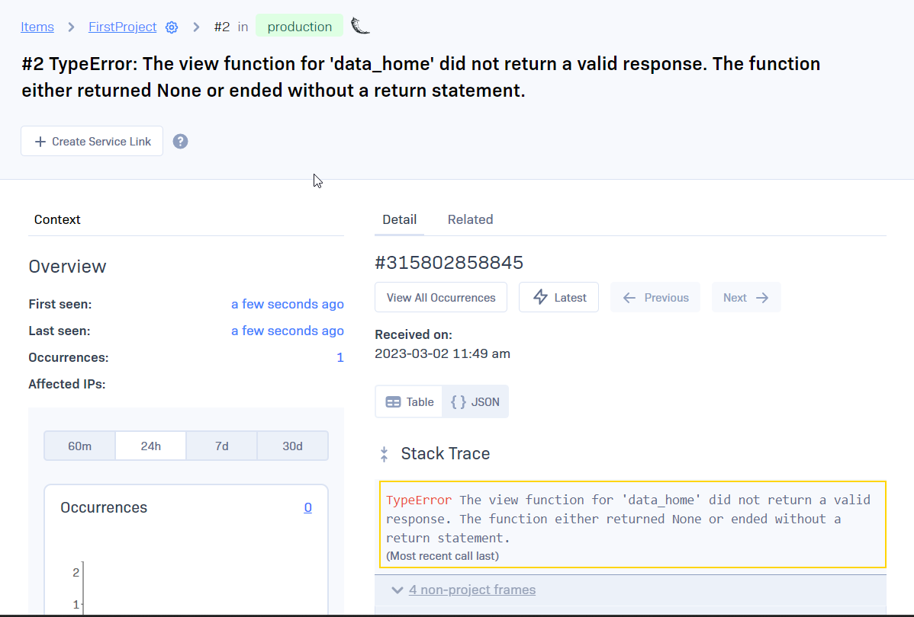
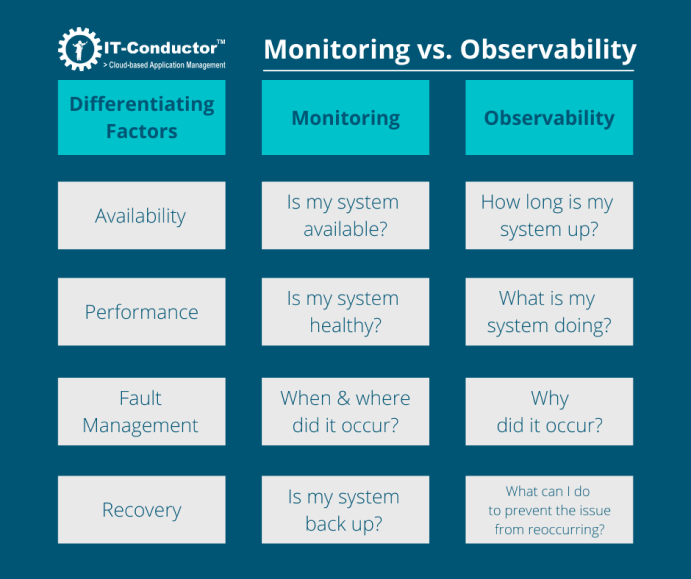
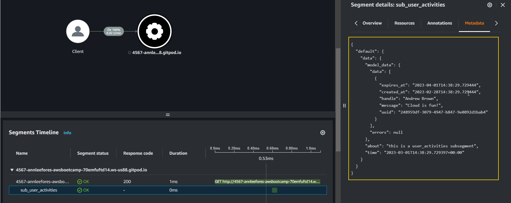
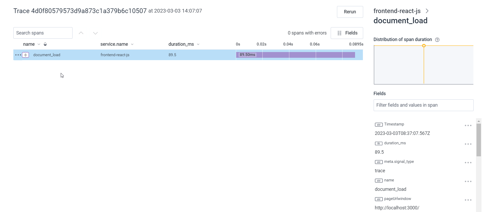

# Week 2 — Distributed Tracing

## Required Homework

- [Live Stream](#observability)  
- [Instrument Honeycomb with OTEL](#honeycombio)
- [Instrument AWS X-Ray](#instrument-aws-xray)
- [Configure custom logger to send to CloudWatch Logs](#cloudwatch-logs)
- [Integrate Rollbar and capture and error](#rollbar)
- [Observability Security Considerations](#security---observability-vs-monitoring-explained-in-aws)
- [Observability Spending Considerations](#spend-considerations)

## [Homework Challenges](#homework-challenges-1)

- [Learned about various Python package managers](#learned-about-various-python-package-managers)
- [AWS X-Ray Sub Segments](#aws-x-ray-sub-segments)
- [.env configuration for docker compose](#env-configuration-for-docker-compose)
- [Learned fundamentals of OpenTelemetry](#learned-fundamentals-of-opentelemetry)
- [Instrument Honeycomb for the frontend-application to observe network latency between frontend and backend](#instrument-honeycomb-for-the-frontend-application-to-observe-network-latency-between-frontend-and-backend)
- [Add custom instrumentation to Honeycomb](#add-custom-instrumentation-to-honeycomb)

---

## Observability

- Observability - monitoring a complicated system.
- Distributed Tracing - method of tracking application requests as they flow from frontend devices to backend services and databases.

## Honeycomb.io

> Website: [https://www.honeycomb.io/](https://www.honeycomb.io/)  
> Honeycomb Python Docs: [https://docs.honeycomb.io/getting-data-in/opentelemetry/python/](https://docs.honeycomb.io/getting-data-in/opentelemetry/python/)

- Login to [Honeycomb.io](https://ui.honeycomb.io/) and create an **Environment**
- Copy the environment API key and export it to gitpod. The same API key must be used throughout the project.

```bash
gp env HONEYCOMB_API_KEY="<api-key>"
gp env HONEYCOMB_SERVICE_NAME="<service-name>"

# or 

export HONEYCOMB_API_KEY="<api-key>"
export HONEYCOMB_SERVICE_NAME="<service-name>"
```

- Set these environment variables in `docker-compose.yml` under backend. `OTEL_SERVICE_NAME` should be different for each service so that they can be distinguished.

```bash
OTEL_SERVICE_NAME: "backend-flask"
OTEL_EXPORTER_OTLP_ENDPOINT: "https://api.honeycomb.io"
OTEL_EXPORTER_OTLP_HEADERS: "x-honeycomb-team=${HONEYCOMB_API_KEY}"
```

- Add these packages to requirements.txt and run `pip3 install -r requirements.txt.`

```
opentelemetry-api 
opentelemetry-sdk
opentelemetry-exporter-otlp-proto-http
opentelemetry-instrumentation-flask
opentelemetry-instrumentation-requests
```

- Add these import statements in `app.py`

```python
from opentelemetry import trace
from opentelemetry.instrumentation.flask import FlaskInstrumentor
from opentelemetry.instrumentation.requests import RequestsInstrumentor
from opentelemetry.exporter.otlp.proto.http.trace_exporter import OTLPSpanExporter
from opentelemetry.sdk.trace import TracerProvider
from opentelemetry.sdk.trace.export import BatchSpanProcessor
```

- Set up tracing and an exporter that can send data to Honeycomb just below all the import statements. `OTLPSpanExporter()` reads the Honeycomb environment variables.

```python
# Initialize tracing and an exporter that can send data to Honeycomb
provider = TracerProvider()
processor = BatchSpanProcessor(OTLPSpanExporter())
provider.add_span_processor(processor)
trace.set_tracer_provider(provider)
tracer = trace.get_tracer(__name__)
```

- Initialize automatic instrumentation with Flask - add this below `app = Flask(__name__)`

```python
# Initialize automatic instrumentation with Flask
FlaskInstrumentor().instrument_app(app)
RequestsInstrumentor().instrument()
```

- Docker compose up and test some backend API usage to see if it works.
- Data graph from Honeycomb.
    

    
- Click trace to view - trace with only one span
    

    
### What is OpenTelemetry?

- OTEL - [OpenTelemetry](https://opentelemetry.io/) → Open source, High-quality, ubiquitous, and portable telemetry to enable effective observability.
    - OTEL is configured to send data to honeycomb through standardized system.
    - Many Distributed Tracing service use `OpenTelemetry`.

### Creating a span

- Change the tracer name and add this line above the class in the home activities service.

```python
from opentelemetry import trace
tracer = trace.get_tracer("tracer.name.here")
```

- Add this line below the `def run()` and indent everything to be inside the `with` statement. Give a unique name. Name here is important.

```python
with tracer.start_as_current_span("http-handler"):
```

- Go to Honeycomb and view recent traces with more than one span.
    

    
### Adding attribute to span

- Add these lines of code in b/w `datetime now` line like this and pass in the `now.isoformat()` to last line.

```python
span = trace.get_current_span()
now = datetime.now(timezone.utc).astimezone()
span.set_attribute("app.now", now.isoformat())
```

- Add this line before the return statement.

```python
span.set_attribute("app.result_length", len(results))
```

- In honeycomb, select **Query** from the Home.
- In **Visualize**, select `COUNT` and in **Group By**, select `trace.trace id` and **RUN QUERY**.
- This query language is not SQL; rather, it is a custom solution. To filter data, use the Query.
- Set time to **Last 10 minutes.**


- To view span details, click on any of the graphs. To get `app.now` and `app.result` length, select the span and search for `app.` on this page.



### Heatmap

- Choose New Query from the LHS menu.
- set **Visualize** to ********HEATMAP(duration_ms)******** and ********P90(duration_ms),******** then run query.



---

## Instrument AWS XRay

> AWS XRay - AWS Built-in Observability Solution


- A daemon service is required for Xray to function.

### Install AWS X-RAY SDK (Python)

> [https://aws.amazon.com/developer/tools/](https://aws.amazon.com/developer/tools/)  
> [https://docs.aws.amazon.com/xray/latest/devguide/xray-sdk-python.html](https://docs.aws.amazon.com/xray/latest/devguide/xray-sdk-python.html)

- Add this to `requirements.txt` and install.

```
aws-xray-sdk
```

- Add this to `app.py`

```python
from aws_xray_sdk.core import xray_recorder
from aws_xray_sdk.ext.flask.middleware import XRayMiddleware
```

- Add these lines under `app = Flask(__name__)`

```python
xray_url = os.getenv("AWS_XRAY_URL")
xray_recorder.configure(service='backend-flask', dynamic_naming=xray_url)
XRayMiddleware(app, xray_recorder)
```

### Create X-Ray Group

```bash
aws xray create-group \
   --group-name "Cruddur" \
   --filter-expression "service(\"backend-flask\")"
```

- Response

```bash
{
    "Group": {
        "GroupName": "Cruddur",
        "GroupARN": "arn:aws:xray:us-east-1:<REDACTED>7434:group/Cruddur/XOGCY6I3BLGOTRTTVR776IUHW3MY56ESPZRJT7HGEIUWPARAI5BQ",
        "FilterExpression": "service(\"backend-flask\")",
        "InsightsConfiguration": {
            "InsightsEnabled": false,
            "NotificationsEnabled": false
        }
    }
}
```

- To ensure that the group has been created, go to AWS X-ray and click the groups section in the left pane under configuration.


### Create Sampling Rule

```bash
aws xray create-sampling-rule --cli-input-json file://aws/json/xray.json
```

- From the X-Ray page, select Sampling. The amount of information you want to see is determined by sampling.
- Create `xray.json` inside `aws/json/` and add this.

```json
{
    "SamplingRule": {
        "RuleName": "Cruddur",
        "ResourceARN": "*",
        "Priority": 9000,
        "FixedRate": 0.1,
        "ReservoirSize": 5,
        "ServiceName": "backend-flask",
        "ServiceType": "*",
        "Host": "*",
        "HTTPMethod": "*",
        "URLPath": "*",
        "Version": 1
    }
  }
```

- To create sampling run this command.

```bash
aws xray create-sampling-rule --cli-input-json file://aws/json/xray.json
```

- Creates a new sampling rule in console.



### Add Deamon Service to Docker Compose

> [https://docs.aws.amazon.com/xray/latest/devguide/xray-daemon.html](https://docs.aws.amazon.com/xray/latest/devguide/xray-daemon.html)

- Add this to `docker-compose.yml`

```yaml
xray-daemon:
    image: "amazon/aws-xray-daemon"
    environment:
      AWS_ACCESS_KEY_ID: "${AWS_ACCESS_KEY_ID}"
      AWS_SECRET_ACCESS_KEY: "${AWS_SECRET_ACCESS_KEY}"
      AWS_REGION: "us-east-1"
    command:
      - "xray -o -b xray-daemon:2000"
    ports:
      - 2000:2000/udp
```

- In `docker-compose.yml`, add these env variables under backend-flask.

```yaml
AWS_XRAY_URL: "*4567-${GITPOD_WORKSPACE_ID}.${GITPOD_WORKSPACE_CLUSTER_HOST}*"
AWS_XRAY_DAEMON_ADDRESS: "xray-daemon:2000"
```

- Now do compose up. Open up backend URL and trigger some API activities.
- To see data, go to the X-Ray console and look at the traces.



- Click into a trace to see more details.
- segments  ==   span
- To avoid spending, comment out all X-Ray-related code and disable X-Ray for cruddur. Remove the sampling rules and the group.

---

## CloudWatch Logs

> [https://pypi.org/project/watchtower/](https://pypi.org/project/watchtower/)

- Add `watchtower` to `requirements.txt` and install.
- Import these in `app.py`

```python
import watchtower
import logging
from time import strftime
```

- Add this just below `app = Flask(__name__)` in app.py

```python
# Configuring Logger to Use CloudWatch
LOGGER = logging.getLogger(__name__)
LOGGER.setLevel(logging.DEBUG)
console_handler = logging.StreamHandler()
cw_handler = watchtower.CloudWatchLogHandler(log_group='cruddur')
LOGGER.addHandler(console_handler)
LOGGER.addHandler(cw_handler)
LOGGER.info('Test log')
```

- Add this above all routes.

```python
@app.after_request
def after_request(response):
    timestamp = strftime('[%Y-%b-%d %H:%M]')
    LOGGER.error('%s %s %s %s %s %s', timestamp, request.remote_addr, request.method, request.scheme, request.full_path, response.status)
    return response
```

- Update `/api/activities/home` route like this to pass LOGGER as args.

```python
@app.route("/api/activities/home", methods=["GET"])
def data_home():
    data = HomeActivities.run(LOGGER)
    return data, 200
```

- Add LOGGER args to functions in `home activities.py` like this: `def run(LOGGER)`: and then insert this line within the function.

```python
LOGGER.info('Hello Cloudwatch! from  /api/activities/home')
```

- Add these env vars under backend in `docker-compose.yml`

```yaml
AWS_DEFAULT_REGION: "${AWS_DEFAULT_REGION}"
AWS_ACCESS_KEY_ID: "${AWS_ACCESS_KEY_ID}"
AWS_SECRET_ACCESS_KEY: "${AWS_SECRET_ACCESS_KEY}"
```

- Relaunch containers.
- Make sure backend is displaying JSON data in home route.
- To view log stream data, launch cloudwatch and navigate to Log Groups.


- To avoid spending, comment everything related to watchtower and cloudwatch, and delete Cruddur from cloudwatch.

---

## Rollbar

> [https://app.rollbar.com/onboarding](https://app.rollbar.com/onboarding)

- Log in to Rollbar, choose a software/package, and then proceed to the sample code page.
- Add these packages to backend `requirements.txt` and install

```
blinker
rollbar
```

- Configure the rollbar access token. The access token can be found in the rollbar project's example code.

```bash
export ROLLBAR_ACCESS_TOKEN=""
gp env ROLLBAR_ACCESS_TOKEN=""
```

- Add Rollbar env to docker-compose under backend.
- Import these modules in `app.py`

```python
import rollbar
import rollbar.contrib.flask
from flask import got_request_exception
```

- Copy paste this under `app = Flask(__name__)`

```python
rollbar_access_token = os.getenv('ROLLBAR_ACCESS_TOKEN')
@app.before_first_request
def init_rollbar():
    """init rollbar module"""
    rollbar.init(
        # access token
        rollbar_access_token,
        # environment name
        'production',
        # server root directory, makes tracebacks prettier
        root=os.path.dirname(os.path.realpath(__file__)),
        # flask already sets up logging
        allow_logging_basic_config=False)

    # send exceptions from `app` to rollbar, using flask's signal system.
    got_request_exception.connect(rollbar.contrib.flask.report_exception, app)
```

- Add this new endpoint

```python
@app.route('/rollbar/test')
def rollbar_test():
    rollbar.report_message('Hello World!', 'warning')
    return "Hello World!"
```

- Continue in the Rollbar to return to the main page. The application that we have currently set up will be listening for incoming messages.
- Launch the application and navigate to the `rollbar/test` endpoint in the backend. This will send a request to rollbar, which will be displayed on the project page.




- I attempted to set an intentional error by commenting out the return from home activities.



---

## Security - Observability vs Monitoring Explained in AWS

### Why logging sucks?

- Time Consuming
- Massive amounts of data with no context for why the security events occurred?
- Looking for a needle in a haystack
- Monolith vs. Services vs. Microservices
- Distributed Modern Applications
- Increase Alert Fatigue for SOC Teams & Application Teams (SREs, DevOps etc)

### Why Observability?

- Reducing Alert Fatigue in Security Operations Teams
- End-to-end visibility of logs, metrics, and tracing
- Troubleshoot and resolve issues quickly and affordably
- Understand application health
- Accelerate collaboration between teams
- Reduce overall operational costs
- Increase customer satisfaction

### Observability vs Monitoring



### 3 Pillars of Observability

- Logs
- Traces - trace problem back to it’s roots
- Metrics

### What is Observability in AWS?


- AWS CloudWatch & AWS CloudTrail (Logs & Metrics)
- [Amazon Detective](https://aws.amazon.com/detective/)
- AWS CloudWatch Tracing

### Building Security Metrics, Logs for Tracing

1. Which Application? (Crown Jewels)
2. Type of application (compute, monolith, microservices)
3. Threat modelling session
4. Identity Attack Vectors
5. Map Attack Vectors to TTP in Attack MITRE Framework
6. Identify instrumentation agents to create tracing (Cloudwatch or FireLens agent, 3rd party agents etc)
7. AWS services like AWS Distro for OpenTelemetry (ADOT) for metrics and traces
8. Dashboard for Practical Attack Vectors only for that application
9. Repeat for next application

Central Observability Platform - Security

Event Driven Security

---

## Spend Considerations

### Honeycomb

- 20 M events are free in honeycomb under free tier per month
- Distributed Tracing
- BubbleUp
- OpenTelemetry Support
- Activity + Team History
- Query Result Permalinks
- Honeycomb Metrics

### Rollbar

- 5000 free events per month
- Unlimited users and projects
- 2FA and encryption at rest
- Real-time feed and alerts
- Intelligent error grouping
- Stack traces and telemetry
- Deploy and version tracking
- People tracking
- Rollbar Query Language (RQL)
- 30 days data retention

### AWS XRAY

- 100,000 traces recorded per month
- 1,000,000 traces scanned or retrieved per month
- Forever free
- There are additional charge for sampling.
- [https://aws.amazon.com/xray/pricing/](https://aws.amazon.com/xray/pricing/)

### Amazon CloudWatch

- 10 Custom Metrics and 10 Alarms
- 1,000,000 API Requests
- 5GB of Log Data Ingestion and 5GB of Log Data Archive
- 3 Dashboards with up to 50 Metrics Each per Month
- Forever free
- [https://aws.amazon.com/cloudwatch/pricing/](https://aws.amazon.com/cloudwatch/pricing/)

---

## Homework Challenges

### Learned about various Python package managers

- The live stream discussion about Python's poor package management got me thinking, so I looked into solutions like [pipenv](https://github.com/pypa/pipenv) and [poetry](https://python-poetry.org/).
- After learning the fundamentals and comparing them, I've decided to use poetry in all of my future Python projects.

---

### AWS X-Ray Sub Segments

- Modified *user_activitities.py* based on the GitHub sample code [given here](https://github.com/aws/aws-xray-sdk-python#start-a-custom-segmentsubsegment).
- However, when I use *begin_subsegment*, it throws a *SegmentNotFoundException*.
- According to the [linked article](https://docs.aws.amazon.com/xray/latest/devguide/xray-sdk-python-middleware.html), when middleware is enabled in a flask application, it automatically creates a segment and uses it for each sampled request.
    
> *When you add the middleware to your application and configure a segment name, the X-Ray SDK for Python creates a segment for each sampled request. This segment includes timing, method, and disposition of the HTTP request. Additional instrumentation creates subsegments on this segment.*

- So perhaps the error occurs because I'm inserting another segment within one that has already been created by middleware.
- According to the same article, the example given in the GitHub docs is for [instrumenting manually in code](https://docs.aws.amazon.com/xray/latest/devguide/xray-sdk-python-middleware.html#xray-sdk-python-middleware-manual) when there is no middleware.
- To put the above statement to the test, I wrote a standalone Python program with segments and subsegments that I ran while the x-ray daemon was running.

```python
from aws_xray_sdk.core import xray_recorder

# Start a segment
segment = xray_recorder.begin_segment('test_segment')
# Start a subsegment
subsegment = xray_recorder.begin_subsegment('test_subsegment')

segment.put_metadata('data', {1: "data1", 2: "data2"})
subsegment.put_metadata('key', '12345')

# Close the subsegment and segment
xray_recorder.end_subsegment()
xray_recorder.end_segment()

print("done")
```

- And I got the custom segment and subsegment data without any problems.


- So I guess I shouldn't use *begin_subsegment* inside an X-Ray middleware application.
- I was able to get results using subsegment.

```python
class UserActivities:
  def run(user_handle):
    model = {
      'errors': None,
      'data': None
    }

    # x-ray subsegment
    subsegment = xray_recorder.begin_subsegment('sub_user_activities')
    now = datetime.now(timezone.utc).astimezone()

    data = {
    "about": "this is a user_activities subsegment",
    "time":now.isoformat(),
    "model_data":model
    }

    subsegment.put_metadata('data', data)
    xray_recorder.end_subsegment()
```



**Reference:**

- [https://github.com/aws/aws-xray-sdk-python#start-a-custom-segmentsubsegment](https://github.com/aws/aws-xray-sdk-python#start-a-custom-segmentsubsegment)
- [https://docs.aws.amazon.com/xray/latest/devguide/xray-sdk-python-subsegments.html](https://docs.aws.amazon.com/xray/latest/devguide/xray-sdk-python-subsegments.html)
- [https://docs.aws.amazon.com/xray/latest/devguide/xray-sdk-python-middleware.html](https://docs.aws.amazon.com/xray/latest/devguide/xray-sdk-python-middleware.html)

---

### `.env` configuration for docker compose

- I created a `.env` file for docker compose so that I can work on the local machine without constantly setting env vars.

**Reference:**
- [https://docs.docker.com/compose/environment-variables/set-environment-variables/](https://docs.docker.com/compose/environment-variables/set-environment-variables/)

---

### Learned fundamentals of OpenTelemetry

- I decided to watch a [freecodecamp video about OpenTelemetry](https://youtu.be/r8UvWSX3KA8) because I was still having trouble understanding all of the jargons and use cases.
- I learned about OTEL and observation.

---

### Instrument Honeycomb for the frontend-application to observe network latency between frontend and backend

> Honeycomb browser tracing: [https://docs.honeycomb.io/getting-data-in/opentelemetry/browser-js/](https://docs.honeycomb.io/getting-data-in/opentelemetry/browser-js/)

Network latency is the time it takes for a packet of data to travel from one point to another. In web applications, network latency can affect the performance and user experience of frontend browser and backend server.

OpenTelemetry browser traces are sent via OTLP with HTTP/JSON. Sensitive data is never safe in the browser. So its recommend to not expose Honeycomb API keys in the browser application’s code. This means we need some kind of proxy to accept any browser traces before sending them to Honeycomb. The most common and recommended solution is to use an [OpenTelemetry Collector](https://docs.honeycomb.io/getting-data-in/otel-collector/).


#### Configuring  `OpenTelemetry Collector`

- Tried out the demo [OTEL Collector example](https://github.com/open-telemetry/opentelemetry-collector-contrib/tree/main/examples/demo)
- Add [OTEL Collector container instructions](https://opentelemetry.io/docs/collector/getting-started/#docker-compose) to `docker-compose.yml`.

```yaml
#OTEL Collector
otel-collector:
  environment:
      FRONTEND_URL_WITHOUT_HTTP: "localhost:3000"
  image: otel/opentelemetry-collector
  command: [--config=/etc/otel-collector-config.yaml]
  volumes:
    - ./otel-collector-config.yaml:/etc/otel-collector-config.yaml
  ports:
    - 4318:4318 # OTLP http receiver
```

- Add `otel-collector-config.yaml` for **[Browser Telemetry](https://docs.honeycomb.io/getting-data-in/otel-collector/#browser-telemetry).**

```yaml
receivers:
  otlp:
    protocols:
      http: # port 4318
        cors:
          allowed_origins:
            - "http://${FRONTEND_URL_WITHOUT_HTTP}"
            - "https://${FRONTEND_URL_WITHOUT_HTTP}"

processors:
  batch:

exporters:
  otlp:
    endpoint: "api.honeycomb.io:443"
    headers:
      "x-honeycomb-team": "${HONEYCOMB_API_KEY}"
  logging:
    verbosity: detailed
    
service:
  pipelines:
    traces:
      receivers: [otlp]
      processors: [batch]
      exporters: [otlp, logging]
```

- `docker compose up`
- OTEL Collector container up and running.

```bash
#OTEL Collector Logs

2023-03-03T06:24:38.651Z        info    service/telemetry.go:90 Setting up own telemetry...
2023-03-03T06:24:38.652Z        info    service/telemetry.go:116        Serving Prometheus metrics      {"address": ":8888", "level": "Basic"}
2023-03-03T06:24:38.656Z        info    service/service.go:140  Starting otelcol...     {"Version": "0.72.0", "NumCPU": 8}
2023-03-03T06:24:38.656Z        info    extensions/extensions.go:41     Starting extensions...
2023-03-03T06:24:38.657Z        warn    internal/warning.go:51  Using the 0.0.0.0 address exposes this server to every network interface, which may facilitate Denial of Service attacks   {"kind": "receiver", "name": "otlp", "data_type": "traces", "documentation": "https://github.com/open-telemetry/opentelemetry-collector/blob/main/docs/security-best-practices.md#safeguards-against-denial-of-service-attacks"}
2023-03-03T06:24:38.657Z        info    otlpreceiver@v0.72.0/otlp.go:112        Starting HTTP server    {"kind": "receiver", "name": "otlp", "data_type": "traces", "endpoint": "0.0.0.0:4318"}
2023-03-03T06:24:38.657Z        info    service/service.go:157  Everything is ready. Begin running and processing data.
```

#### Checking OTEL Collector

- Ran this curl command to make sure OTEL collector is working as indented.

```bash
curl -i http://localhost:4318/v1/traces -H "Origin: http://localhost:3000" -H "Access-Control-Request-Method: POST" -H "Access-Control-Request-Headers: X-Requested-With" -H "Content-Type: application/json" -X OPTIONS --verbose
```

- Got this response. So OTEL Collector is working.

```bash
Access-Control-Allow-Credentials: true
Access-Control-Allow-Headers: X-Requested-With
Access-Control-Allow-Methods: POST
Access-Control-Allow-Origin: http://localhost:3000
Vary: Origin
Vary: Access-Control-Request-Method
Vary: Access-Control-Request-Headers
Date: Fri, 03 Mar 2023 07:58:06 GMT
```

#### Frontend OTEL

- Install the following npm packages ([based on Honeycomb Browser guide](https://docs.honeycomb.io/getting-data-in/opentelemetry/browser-js/#instrumentation-packages))

```bash
npm install --save \
    @opentelemetry/api \
    @opentelemetry/sdk-trace-web \
    @opentelemetry/exporter-trace-otlp-http \
    @opentelemetry/context-zone
```

- Export env variable (only on localhost)

```bash
OTEL_COLLECTOR_URL=http://localhost:4318
```

- Add this environment variable to the frontend docker-compose instruction.

```yaml
REACT_APP_OTEL_COLLECTOR_URL: "${OTEL_COLLECTOR_URL}"
```

- Create a file `tracing.js` inside `src/otel/` folder and add this code.

```jsx
import { OTLPTraceExporter } from '@opentelemetry/exporter-trace-otlp-http';
import { WebTracerProvider, BatchSpanProcessor } from '@opentelemetry/sdk-trace-web';
import { ZoneContextManager } from '@opentelemetry/context-zone';
import { Resource }  from '@opentelemetry/resources';
import { SemanticResourceAttributes } from '@opentelemetry/semantic-conventions';

const exporter = new OTLPTraceExporter({
  url: `${process.env.REACT_APP_OTEL_COLLECTOR_URL}/v1/traces`
});
const provider = new WebTracerProvider({
  resource: new Resource({
    [SemanticResourceAttributes.SERVICE_NAME]: "frontend-react-js",
  }),
});
provider.addSpanProcessor(new BatchSpanProcessor(exporter));
provider.register({
  contextManager: new ZoneContextManager()
});
```

- Import this file in `index.js`

```jsx
import "./otel/tracing.js"; // otel collector
```

- Add instrumentation for actions in `pages/HomeFeedPage.js`

```java
import { trace } from '@opentelemetry/api';

const tracer = trace.getTracer();

const rootSpan = tracer.startActiveSpan('document_load', span => {
  span.setAttribute('pageUrlwindow', window.location.href);
  window.onload = (event) => {
    
    span.end(); 
  };
});
```

#### Troubleshooting Frontend - OTEL Collector Communication

- This error was appearing in my Collector logs.

```java
Exporting failed. The error is not retryable. Dropping data.    {"kind": "exporter", "data_type": "traces", "name": "otlp", "error": "Permanent error: rpc error: code = Unauthenticated desc = missing 'x-honeycomb-team' header", "dropped_items": 1}
```

- When looking for solutions, I came across this [test span writeup by Jessica Kerr](https://www.honeycomb.io/blog/test-span-opentelemetry-collector) in a honeycomb blog.
- So I experimented by sending a curl request with Insomnia.


- The issue was that I did not pass *HONEYCOMB_API_KEY* to OTEL Collector environment via docker compose. So, in *docker-compose.yml*, I added this variable to the otel-collector service.

```yaml
#OTEL Collector
otel-collector:
  environment:
      HONEYCOMB_API_KEY: "${HONEYCOMB_API_KEY}"
      FRONTEND_URL_WITHOUT_HTTP: "localhost:3000"
  image: otel/opentelemetry-collector
  command: [--config=/etc/otel-collector-config.yaml]
  volumes:
    - ./otel-collector-config.yaml:/etc/otel-collector-config.yaml
  ports:
    - 4318:4318 # OTLP http receiver
```

- Following that, test data results began to appear on the Honeycomb dashboard.

#### Testing Frontend Tracing

- Opened frontend homepage to trigger document-load span.
- Received trace data in Honeycomb dashboard



#### Connecting the Frontend and Backend Traces

- [Automatically Propagate the Trace Context Header](https://docs.honeycomb.io/getting-data-in/opentelemetry/browser-js/#automatically-propagate-the-trace-context-header)
- Install the npm dependencies.

```bash
npm install --save \
    @opentelemetry/instrumentation \
    @opentelemetry/instrumentation-xml-http-request \
    @opentelemetry/instrumentation-fetch
```

- Import dependencies into `HomeFeedPage.js`

```jsx
import { XMLHttpRequestInstrumentation } from '@opentelemetry/instrumentation-xml-http-request';
import { FetchInstrumentation } from '@opentelemetry/instrumentation-fetch';
import { registerInstrumentations } from '@opentelemetry/instrumentation';
```

- Replace the previous *rootSpan page-load* code with this one.
- I created the backend URL regex using the new ChatGPT powered Bing.

```jsx
registerInstrumentations({
  instrumentations: [
    new XMLHttpRequestInstrumentation({
      propagateTraceHeaderCorsUrls: [
         /.+/g, /^http:\/\/localhost:4567\/.*$/
      ]
    }),
    new FetchInstrumentation({
      propagateTraceHeaderCorsUrls: [
         /.+/g, /^http:\/\/localhost:4567\/.*$/
      ]
    }),
  ],
});
```

- When I tried to open the frontend, I received this CORS error.

```bash
Request header field traceparent is not allowed by Access-Control-Allow-Headers in preflight response.
```

- The headers relayed by the frontend.

```bash
Referer: http://localhost:3000/
sec-ch-ua: "Chromium";v="110", "Not A(Brand";v="24", "Google Chrome";v="110"
sec-ch-ua-mobile: ?1
sec-ch-ua-platform: "Android"
traceparent: 00-d9aa63dc2816eff5b0ee5729cc15cb4a-3940695fd6146820-01
```

- The issue was not resolved for some reason even after allowing `traceparent` in flask.
- One of the bootcamp member, Allan Hsu#4942, had already posted a solution to this problem.
- According to the [flask-cors docs](https://flask-cors.readthedocs.io/en/latest/configuration.html), CORS_ALLOW_HEADERS must be a string or a list. So I replaced the existing `allow_headers`  string with a list in `app.py`, which resolved the CORS error.

```python
cors = CORS(
    app,
    resources={r"/api/*": {"origins": origins}},
    expose_headers="location,link",
    allow_headers=["content-type", "if-modified-since", "traceparent"],
    methods="OPTIONS,GET,HEAD,POST",
)
```

- I can now see the entire distributed trace between the frontend and backend in the Honeycomb dashboard.


- Changes were made to the code to ensure that the OTEL frontend-backend trace worked correctly in Gitpod and local development.
- Tracing results in Gitpod.


- I added some extra automatic instrumentation to check Document Load and User Interaction.

```bash
npm install --save \
    @opentelemetry/instrumentation-document-load \
    @opentelemetry/instrumentation-user-interaction \
    @opentelemetry/instrumentation-long-task
```

```jsx
import { DocumentLoadInstrumentation } from '@opentelemetry/instrumentation-document-load';
import { UserInteractionInstrumentation } from '@opentelemetry/instrumentation-user-interaction';

// ...general opentelemetry configuration

registerInstrumentations({
    instrumentations: [
      
      // request instrumentation

      new DocumentLoadInstrumentation(),
      new UserInteractionInstrumentation(),
    ],
  });


```


**Reference:**

- [https://docs.honeycomb.io/getting-data-in/opentelemetry/browser-js/](https://docs.honeycomb.io/getting-data-in/opentelemetry/browser-js/)
- [https://docs.honeycomb.io/getting-data-in/otel-collector/](https://docs.honeycomb.io/getting-data-in/otel-collector/)
- [https://opentelemetry.io/docs/collector/getting-started/](https://opentelemetry.io/docs/collector/getting-started/)
- [https://opentelemetry.io/docs/instrumentation/js/getting-started/browser/](https://opentelemetry.io/docs/instrumentation/js/getting-started/browser/)
- [https://opentelemetry.io/docs/instrumentation/js/instrumentation/](https://opentelemetry.io/docs/instrumentation/js/instrumentation/)
- [https://www.honeycomb.io/blog/test-span-opentelemetry-collector](https://www.honeycomb.io/blog/test-span-opentelemetry-collector)

---

### Add custom instrumentation to Honeycomb

- Added nested span and attributes within home activities

```python
user = {"user": "Annlee", "userID": 123456}

span.set_attribute("app.result_length", len(results))

with tracer.start_as_current_span("my-cool-function") as inner_span:

    inner_span.set_attribute("inner", True)
    span.set_attribute("user.id", user.get("user"))

    with tracer.start_as_current_span("my-cool-function-2") as sub_inner_span:
        span.set_attribute("user.id", user.get("userID"))
```

- Span with function decorators.

```python
@tracer.start_as_current_span("do_work")
def do_work():
    print("doing some work...")
```

- Added events for a nested span.

```python
current_span = trace.get_current_span()

current_span.add_event("Gonna try it!")

current_span.add_event("Did it!")
```

- Set span status.

```python
from opentelemetry.trace import Status, StatusCode

try:
    # something that might fail
		print(x)
except:
    current_span.set_status(Status(StatusCode.ERROR))
```


**Reference:**

- [https://docs.honeycomb.io/getting-data-in/opentelemetry/python/](https://docs.honeycomb.io/getting-data-in/opentelemetry/python/)
- [https://opentelemetry.io/docs/instrumentation/python/manual/](https://opentelemetry.io/docs/instrumentation/python/manual/)