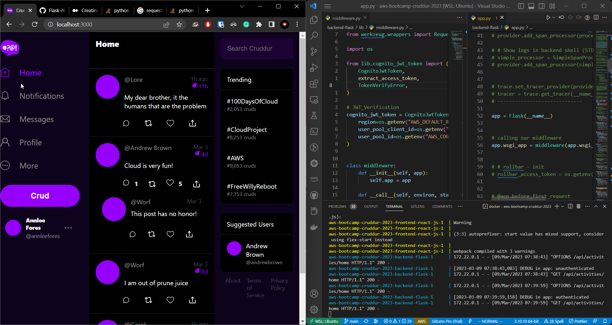
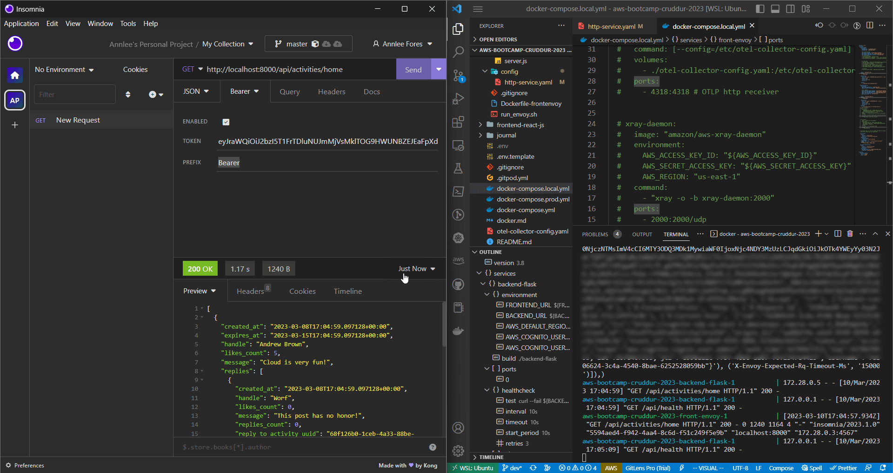
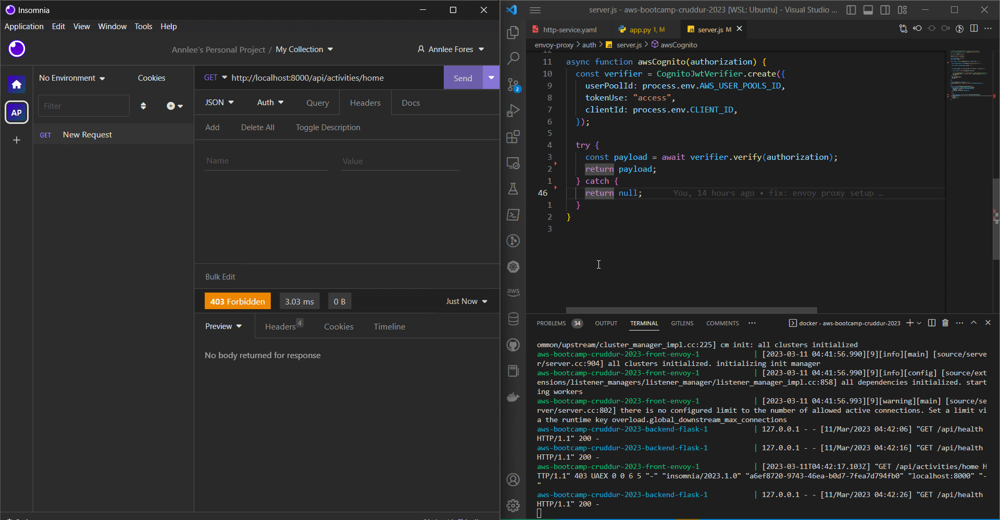

# Week 3 — Decentralized Authentication

## [Required Homework](#required-homework-1)


## [Homework Challenges](#homework-challenges-1)

- [Learned about JWT](#learned-about-jwt)
- [Gaining insight into the existing process of verifying JWTs](#gaining-insight-into-the-existing-process-of-verifying-jwts)
- [Decouple the JWT verify from the application code by writing a Flask Middleware](#decouple-the-jwt-verify-from-the-application-code-by-writing-a-flask-middleware)
- [[Double Hard] Decouple the JWT verify process by using Envoy and `aws-jwt-verify.js` library as sidecar container](#double-hard-decouple-the-jwt-verify-process-by-using-envoy-and-aws-jwt-verifyjs-library-as-sidecar-container)


---

## Required Homework

---
## Homework Challenges

### Learned about JWT

- Learned the difference between session and JWT based authentication
- Structure of a JWT - Header, Payload, Signature
- Refresh tokens
- Asymmetric and Symmetric JWTs
- Different approaches and best practices in JWT based auth
- Pros and cons of JWT authentication

**Reference:**

- [https://www.geeksforgeeks.org/session-vs-token-based-authentication/](https://www.geeksforgeeks.org/session-vs-token-based-authentication/)
- [https://www.rfc-editor.org/rfc/rfc7519](https://www.rfc-editor.org/rfc/rfc7519)
- [https://jwt.io/introduction](https://jwt.io/introduction)
- [A Beginner's Guide to JWTs | Okta Developer](https://developer.okta.com/blog/2020/12/21/beginners-guide-to-jwt)
- [https://youtu.be/T0k-3Ze4NLo](https://youtu.be/T0k-3Ze4NLo)

---
### Gaining insight into the existing process of verifying JWTs

#### AWS Cognito JWT

- [https://docs.aws.amazon.com/cognito/latest/developerguide/amazon-cognito-user-pools-using-tokens-with-identity-providers.html](https://docs.aws.amazon.com/cognito/latest/developerguide/amazon-cognito-user-pools-using-tokens-with-identity-providers.html)

#### Validate JWT

- [https://docs.aws.amazon.com/cognito/latest/developerguide/amazon-cognito-user-pools-using-tokens-verifying-a-jwt.html](https://docs.aws.amazon.com/cognito/latest/developerguide/amazon-cognito-user-pools-using-tokens-verifying-a-jwt.html)
- [https://aws.amazon.com/premiumsupport/knowledge-center/decode-verify-cognito-json-token/](https://aws.amazon.com/premiumsupport/knowledge-center/decode-verify-cognito-json-token/)

#### Working of current JWT verification

**Frontend**

- In frontend sign in page, `access_token` is stored in *localStorage*.
- The authorization header in the request from HomeFeedPage.js to the backend includes the access_token.

```js
headers: {
  Authorization: `Bearer ${localStorage.getItem("access_token")}`,
},
```

**Backend**

- **CognitoJwtToken** is initialized with the region, client ID, and pool ID.
- In addition, this code initializes a request to retrieve JWKS for the *user_pool_id* from the source given below and stores it in the `self.jwk_keys` variable.

```bash
https://cognito-idp.{self.region}.amazonaws.com/{self.user_pool_id}/.well-known/jwks.json
```

- The backend endpoint receives this request, and the data is extracted using `extract_access_token`.
    - In `extract_access_token`, the value associated with the Authorization key is selected from the request, and then "Bearer" is split from it to get the access_token.
- Then this `access_token` is verified using `cognito_jwt_token.verify(access_token)`
- in `verify()`
    - The header in the access_token JWT is decoded using a library to obtain the `kid`
     value.
    - The corresponding public key JSON is then found from the `jwks` using a for loop, and the token signature is verified using this public key.
    - If the verification fails, the`_verify_signature(token, pkey_data)` function raises an error.
    - After verification, the claims are extracted from the token using a library, and the expiry of the token is checked.
    - Additionally, the audience ("aud") specified in the payload is verified to match the app client ID created in the Amazon Cognito user pool.
    - Finally, the claims with userdata are returned.
- Code implemention follows the AWS docs and is similar to the one implemented here [awslabs github implementation](https://github.com/awslabs/aws-support-tools/blob/master/Cognito/decode-verify-jwt/decode-verify-jwt.py)

#### Changes that I made to JWT verification code

- To improve the implementation, I added the `extract_access_token` function as a class method to `CognitoJwtToken`, which combines the separate lines for access_token and claims.

```python
def extract_access_token(self, request_headers):
    access_token = None
    auth_header = request_headers.get("Authorization")
    if auth_header and " " in auth_header:
        _, access_token = auth_header.split()
    return self.verify(access_token)
```

```python
claims = cognito_jwt_token.extract_access_token(request.headers)
```
---
### Decouple the JWT verify from the application code by writing a Flask Middleware

#### Middleware working explained

- All requests that come to the backend pass through middleware.
- In this implementation, the middleware verifies the **access_token** when a request with an Authorization header is received.
- If the **access_token** is valid, the **auth** value is set to true, and the claim data is sent over to the route using **request.environ**.
- If the **access_token** is invalid, the auth value is set to false, and the claim is set to None.
- Inside `app.py`, these **request.environ** data is used to create conditionals.

#### Implementation

- To create the middleware, I added a file called `middleware.py` inside the `lib/` directory and added the following code.

```python
from werkzeug.wrappers import Request

import os

from lib.cognito_jwt_token import (
    CognitoJwtToken,
    TokenVerifyError,
)

# JWT_Verification
cognito_jwt_token = CognitoJwtToken(
    region=os.getenv("AWS_DEFAULT_REGION"),
    user_pool_client_id=os.getenv("AWS_COGNITO_USER_POOL_CLIENT_ID"),
    user_pool_id=os.getenv("AWS_COGNITO_USER_POOL_ID"),
)

class middleware:
    def __init__(self, app):
        self.app = app

    def __call__(self, environ, start_response):

        request = Request(environ)

        if "Authorization" in request.headers:

            try:
                claims = cognito_jwt_token.extract_access_token(request.headers)

                # transfer data through request
                environ["auth"] = True
                environ["claims"] = claims

            except TokenVerifyError as e:

                print("unauthenticated", e)
                # transfer data through request
                environ["auth"] = False
                environ["claims"] = None

        return self.app(environ, start_response)
```

- Removed **cognito_jwt_token** import and initialization from `app.py`
- Imported **middleware** in `app.py`

```python
from lib.middleware import middleware
```

- Added this code under `app = Flask(__name__)`

```python
# calling our middleware
app.wsgi_app = middleware(app.wsgi_app)
```

- Updated home route like this

```python
@app.route("/api/activities/home", methods=["GET"])
def data_home():

    auth_state = request.environ["auth"]
    claims = request.environ["claims"]

    if auth_state:
        data = HomeActivities.run(cognito_user_id=claims["username"])
        app.logger.debug("authenticated")
    else:
        app.logger.debug("unauthenticated")
        data = HomeActivities.run()

    return data, 200
```

- Unauthenticated


- Authenticated



**Reference:**

- [https://medium.com/swlh/creating-middlewares-with-python-flask-166bd03f2fd4](https://medium.com/swlh/creating-middlewares-with-python-flask-166bd03f2fd4)
- [https://stackoverflow.com/questions/51691730/flask-middleware-for-specific-route](https://stackoverflow.com/questions/51691730/flask-middleware-for-specific-route)
- [https://codingshower.com/profiling-python-flask-web-apps-with-werkzeug-middleware-application-profiler/](https://codingshower.com/profiling-python-flask-web-apps-with-werkzeug-middleware-application-profiler/)

---
### [Double Hard] Decouple the JWT verify process by using Envoy and `aws-jwt-verify.js` library as sidecar container


> I could have used Envoy Proxy [built-in JWT auth extension](https://www.envoyproxy.io/docs/envoy/latest/api-v3/extensions/filters/http/jwt_authn/v3/config.proto), but I decided to combine envoy proxy and `aws-jwt-verify` challenge into one 🔥🔥

#### What is container sidecar pattern?

The sidecar container pattern is a design pattern used in Docker Compose where an additional container (known as a "sidecar" container) is deployed alongside a primary container to provide additional functionality or support services.

- [https://docs.dapr.io/operations/hosting/self-hosted/self-hosted-with-docker/](https://docs.dapr.io/operations/hosting/self-hosted/self-hosted-with-docker/)
- [https://www.vittorionardone.it/en/2021/02/16/pattern-sidecars-ambassadors-and-adapters-containers/](https://www.vittorionardone.it/en/2021/02/16/pattern-sidecars-ambassadors-and-adapters-containers/)

#### What is envoy proxy

- [https://tetrate.io/what-is-envoy-proxy/](https://tetrate.io/what-is-envoy-proxy/)
- Envoy as API gateway to handle inbound traffic.

#### Testing envoy proxy sandbox for front proxy and external auth

- [https://www.envoyproxy.io/docs/envoy/latest/start/sandboxes/ext_authz](https://www.envoyproxy.io/docs/envoy/latest/start/sandboxes/ext_authz)
- [https://www.envoyproxy.io/docs/envoy/latest/start/sandboxes/front_proxy.html](https://www.envoyproxy.io/docs/envoy/latest/start/sandboxes/front_proxy.html)

#### Implementation

- I based my authentication architecture on [External authorization (`ext_authz`) filter example](https://www.envoyproxy.io/docs/envoy/latest/start/sandboxes/ext_authz) in envoy proxy.
- Added these services to `docker-compose.yml` file in order to launch the front proxy Envoy sidecar and `aws-jwt-verify` sidecar:

```yaml
front-envoy:
    build:
      context: ./envoy-proxy
      dockerfile: Dockerfile-frontenvoy
    depends_on:
      backend-flask:
        condition: service_healthy
    environment:
      FRONT_ENVOY_YAML: "config/http-service.yaml"
    ports:
      - "${PORT_PROXY:-8000}:8000"

  ext_authz-http-service:
    build:
      context: ./envoy-proxy/auth
      dockerfile: Dockerfile
    environment:
      AWS_USER_POOLS_ID: "${AWS_USER_POOLS_ID}"
      CLIENT_ID: "${CLIENT_ID}"
```

- Created a folder named **envoy-proxy** in the root directory.
- Inside that folder, created a Dockerfile named `Dockerfile-frontenvoy` and added the following instructions.

```docker
FROM envoyproxy/envoy-dev:latest

COPY ./config /etc/envoy-config
COPY ./run_envoy.sh /run_envoy.sh
RUN chmod go+r -R /etc/envoy-config \
    && chmod go+rx /run_envoy.sh /etc/envoy-config /etc/envoy-config/*
CMD ["/bin/sh", "/run_envoy.sh"]
```

- Created a file called `run_envoy.sh` and added the following bash script:

```bash
#!/bin/sh

/usr/local/bin/envoy -c "/etc/envoy-${FRONT_ENVOY_YAML}" --service-cluster front-proxy
```

- Created a YAML file named `http-service.yaml` inside `config` folder. This file is used to configure the Envoy proxy.

```yaml
static_resources:
  listeners:
    - address:
        socket_address:
          address: 0.0.0.0
          port_value: 8000
      filter_chains:
        - filters:
            - name: envoy.filters.network.http_connection_manager
              typed_config:
                "@type": type.googleapis.com/envoy.extensions.filters.network.http_connection_manager.v3.HttpConnectionManager
                codec_type: AUTO
                stat_prefix: ingress_http
                access_log:
                  - name: envoy.access_loggers.stdout
                    typed_config:
                      "@type": type.googleapis.com/envoy.extensions.access_loggers.stream.v3.StdoutAccessLog
                route_config:
                  name: local_route
                  virtual_hosts:
                    - name: backend
                      domains:
                        - "*"
                      routes:
                        - match:
                            prefix: "/api/activities/home"
                          route:
                            cluster: backend-flask

                      cors:
                        allow_origin_string_match:
                          - prefix: "*"
                        allow_methods: GET, PUT, DELETE, POST, OPTIONS
                        allow_headers: origin,keep-alive,user-agent,cache-control,content-type,content-transfer-encoding,custom-header-1,x-accept-content-transfer-encoding,x-accept-response-streaming,x-user-agent,Authorization
                        expose_headers: Authorization
                        max_age: "1728000"

                http_filters:
                  
                  - name: envoy.filters.http.ext_authz
                    typed_config:
                      "@type": type.googleapis.com/envoy.extensions.filters.http.ext_authz.v3.ExtAuthz
                      transport_api_version: V3
                      http_service:
                        server_uri:
                          uri: ext_authz
                          cluster: ext_authz-http-service
                          timeout: 0.200s
                        authorization_response:
                          allowed_upstream_headers:
                            patterns:
                              - exact: x-current-user
                  - name: envoy.filters.http.router
                    typed_config:
                      "@type": type.googleapis.com/envoy.extensions.filters.http.router.v3.Router

  clusters:
    - name: backend-flask
      type: STRICT_DNS
      lb_policy: ROUND_ROBIN
      load_assignment:
        cluster_name: backend-flask
        endpoints:
          - lb_endpoints:
              - endpoint:
                  address:
                    socket_address:
                      address: backend-flask
                      port_value: 4567

    - name: ext_authz-http-service
      type: STRICT_DNS
      lb_policy: ROUND_ROBIN
      load_assignment:
        cluster_name: ext_authz-http-service
        endpoints:
          - lb_endpoints:
              - endpoint:
                  address:
                    socket_address:
                      address: ext_authz-http-service
                      port_value: 9002
```

- Created a folder called `auth`. Inside the folder, implemented a Node.js server for authentication and a Dockerfile to containerize the authentication server.
- Installed `aws-jwt-verify`

```bash
npm install aws-jwt-verify
```

- Created a file called `server.js` inside the `auth` folder and added a simple Node.js server to verify JWT token using `aws-jwt-verify`.

```jsx
// import { CognitoJwtVerifier } from "aws-jwt-verify";
const { CognitoJwtVerifier } = require("aws-jwt-verify");

var http = require("http");

require("dotenv").config();

const hostname = "0.0.0.0";
const port = 9002;

const server = http.createServer(async (req, res) => {

  const authorization = req.headers["authorization"] || "";

  const token = authorization.split(" ");

  if (token.length === 2 && token[0] === ("Bearer" || "bearer")) {

    const result = await awsCognito(token[1]);
    res.writeHead(200, { "x-current-user": JSON.stringify(result) });
    res.end();
  }
  res.writeHead(403);
  res.end();

});

server.listen(port, hostname, () => {
  console.log(`Server running at http://${hostname}:${port}/`);
});

async function awsCognito(authorization) {
  const verifier = CognitoJwtVerifier.create({
    userPoolId: process.env.AWS_USER_POOLS_ID,
    tokenUse: "access",
    clientId: process.env.CLIENT_ID,
  });

  try {
    const payload = await verifier.verify(authorization);
    return payload;
  } catch {
    return null;
  }
}
```

- I faced some errors related to the async function, but I was able to solve them by making the 'createServer' function async.
- I tested it locally by running the server on its own and sending a GET request with a demo token to verify that it's working.

```bash
❯ node server.js
Server running at http://localhost:9002/
Token not valid!
```

- Created a Dockerfile for this authentication server.

```docker
FROM node:16.19.1-alpine3.16

WORKDIR /usr/src/app

COPY package*.json ./

RUN npm install

COPY . . 

EXPOSE 9002 

CMD ["node", "server.js"]
```

- Created a `.dockerignore` file to block the `node_modules` directory, and a `.gitignore` file to block any unwanted packages from getting pushed to GitHub.
- In the end, the file structure inside the `envoy-proxy` folder looks like this:

```jsx
├── Dockerfile-frontenvoy
├── auth
│   ├── Dockerfile
│   ├── package-lock.json
│   ├── package.json
│   └── server.js
├── config
│   └── http-service.yaml
└── run_envoy.sh
```

#### Running entire application

- Updated the frontend `HomeFeedPage.js` fetch request to go through port 8000 (proxy) instead of port 4567.

```jsx
const backend_url = `http://localhost:8000/api/activities/home`;
      const res = await fetch(backend_url, {
        headers: {
          'Content-Type': 'application/json',
          'Authorization': `Bearer ${localStorage.getItem("access_token")}`,
        },
        method: "GET",
      });
```

- In root folder run `docker compose -f docker-compose.local.yml up --build`
- Envoy proxy container will start once the backend container's health status turns to healthy.
- I faced an issue where the request was not reaching the backend-flask application.

#### Debugging Proxy not working

- Tested every service individually to make sure that they are working perfectly.
- I was able to get it to work, but now the front proxy is blocking the authentication token.


- I also confirmed that authentication is working inside the Auth container

```bash
aws-bootcamp-cruddur-2023-ext_authz-http-service-1  | {
aws-bootcamp-cruddur-2023-ext_authz-http-service-1  |   host: 'localhost:8000',
aws-bootcamp-cruddur-2023-ext_authz-http-service-1  |   'content-length': '0',
aws-bootcamp-cruddur-2023-ext_authz-http-service-1  |   'x-envoy-internal': 'true',
aws-bootcamp-cruddur-2023-ext_authz-http-service-1  |   'x-forwarded-for': '172.23.0.5',
aws-bootcamp-cruddur-2023-ext_authz-http-service-1  |   'x-envoy-expected-rq-timeout-ms': '250'
aws-bootcamp-cruddur-2023-ext_authz-http-service-1  | }
aws-bootcamp-cruddur-2023-front-envoy-1             | [2023-03-10T16:02:09.153Z] "OPTIONS /api/activities/home HTTP/1.1" 403 UAEX 0 0 4 2 "-" "Mozilla/5.0 (Windows NT 10.0; Win64; x64) AppleWebKit/537.36 (KHTML, like Gecko) Chrome/111.0.0.0 Safari/537.36" "0701d2ff-559f-46c7-9cbc-28ab80e8a045" "localhost:8000" "-"
aws-bootcamp-cruddur-2023-backend-flask-1           | 127.0.0.1 - - [10/Mar/2023 16:02:15] "GET /api/health HTTP/1.1" 200 -
aws-bootcamp-cruddur-2023-backend-flask-1           | 127.0.0.1 - - [10/Mar/2023 16:02:25] "GET /api/health HTTP/1.1" 200 -
```

- It turns out that the authentication request was timing out even before the `aws-jwt-verify` could complete its job. Turning up the timeout to 5 seconds in `http-service.yaml` solved that issue for the Insomnia API test.

```yaml
server_uri:
  uri: ext_authz
  cluster: ext_authz-http-service
  timeout: 0.200s
```



- At this point, I still had to figure out why the frontend is not loading data

```bash
Response to preflight request doesn't pass access control check: No 'Access-Control-Allow-Origin' header is present on the requested resource. If an opaque response serves your needs, set the request's mode to 'no-cors' to fetch the resource with CORS disabled.
```

- I tried fixing the way we are sending the request from the frontend, but that did not solve the issue.
- I found out that the OPTIONS request from the browser was getting blocked by the proxy.
- Finally, I realized that it was a CORS issue with the frontend Envoy proxy that was blocking the OPTIONS request sent out by the browser. Since the OPTIONS request was blocked, the GET request also failed.

<p align=center></p>

- After a lot of debugging and implementing possible solutions, adding this filter under `http_filters` in `http-service.yaml` solved the CORS issue. Phew….

```bash
- name: envoy.filters.http.cors
  typed_config:
    "@type": type.googleapis.com/envoy.extensions.filters.http.cors.v3.Cors
```

- I updated the backend home route to conditionally send data.

```python
import json

@app.route("/api/activities/home", methods=["GET"])
def data_home():

    auth_state = request.headers.get("X-Current-User")

    if auth_state != "null":
        claims = json.loads(auth_state)
        app.logger.debug(claims)
        data = HomeActivities.run(cognito_user_id=claims["username"])
        app.logger.debug("authenticated")
    else:
        app.logger.debug("unauthenticated")
        data = HomeActivities.run()

    return data, 200
```

- Now the entire application is working as expected.
- Blocks all requests without authorization header.



- Allows requests with an authorization header.


- Sends non-authorized data when the user is unauthenticated.


- Sends authorized data when authenticated.


- All of these extra hops have added about 1 second of latency to the entire authentication process.

**Reference:**

- [https://www.envoyproxy.io/docs/envoy/latest/start/sandboxes/ext_authz](https://www.envoyproxy.io/docs/envoy/latest/start/sandboxes/ext_authz)
- [https://github.com/envoyproxy/envoy/tree/main/examples](https://github.com/envoyproxy/envoy/tree/main/examples)
- [https://www.envoyproxy.io/docs/envoy/latest/start/sandboxes/front_proxy](https://www.envoyproxy.io/docs/envoy/latest/start/sandboxes/front_proxy)
- [https://www.envoyproxy.io/docs/envoy/latest/start/sandboxes/cors](https://www.envoyproxy.io/docs/envoy/latest/start/sandboxes/cors)
- [https://www.bogotobogo.com/DevOps/Docker/Docker-Envoy-Front-Proxy.php](https://www.bogotobogo.com/DevOps/Docker/Docker-Envoy-Front-Proxy.php)
- [https://medium.com/@upgrade.outdated/how-to-use-envoy-separate-cross-cutting-concerns-of-web-app-security-1ca869bbfd40](https://medium.com/@upgrade.outdated/how-to-use-envoy-separate-cross-cutting-concerns-of-web-app-security-1ca869bbfd40)
- [https://www.digitalocean.com/community/tutorials/how-to-create-a-web-server-in-node-js-with-the-http-module](https://www.digitalocean.com/community/tutorials/how-to-create-a-web-server-in-node-js-with-the-http-module)
- [https://nodejs.org/en/docs/guides/getting-started-guide/](https://nodejs.org/en/docs/guides/getting-started-guide/)