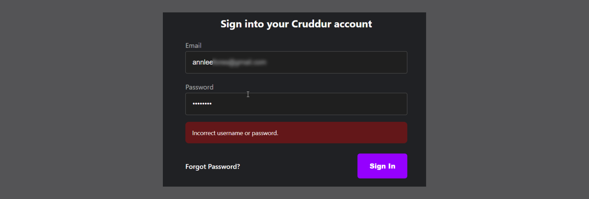
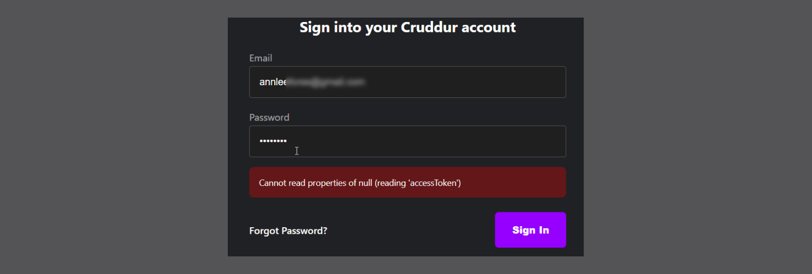
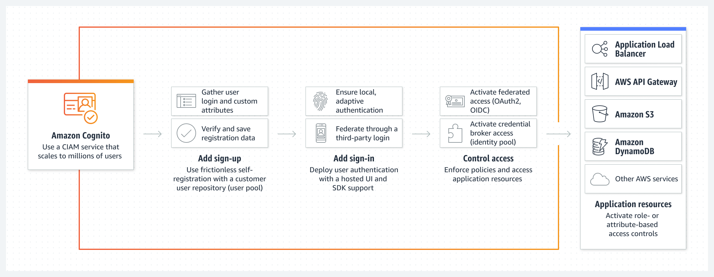
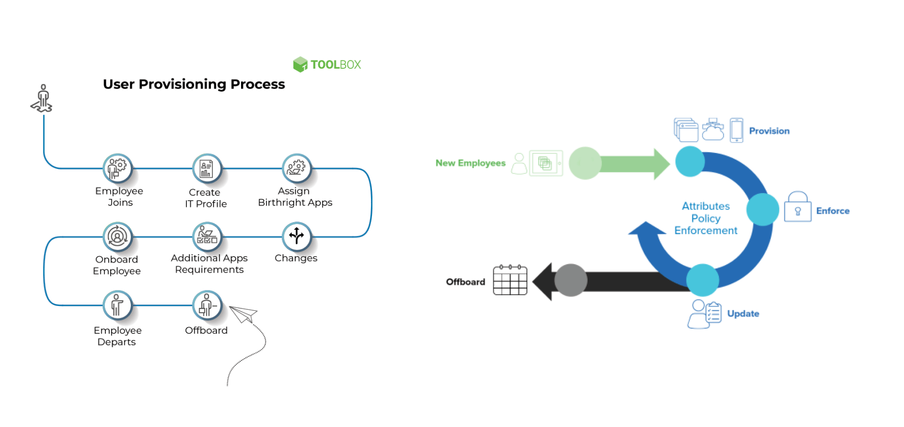
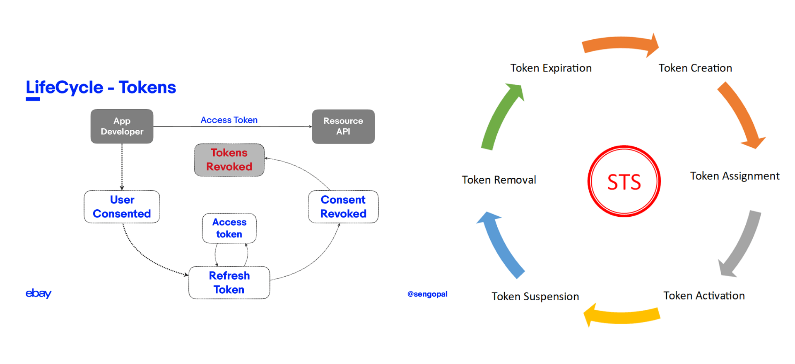
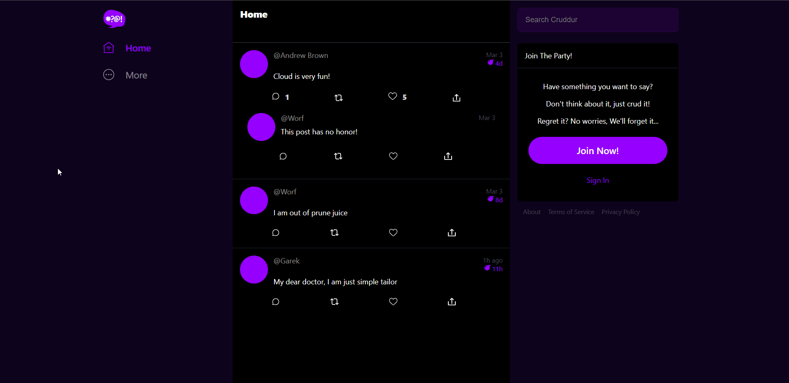
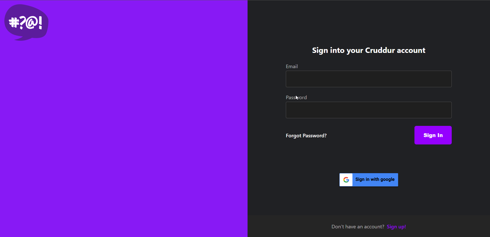
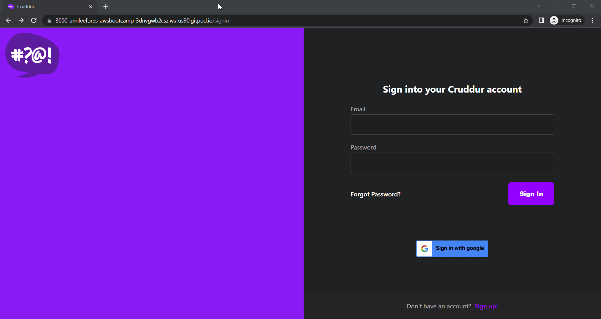

# Week 3 — Decentralized Authentication

## [Required Homework](#required-homework-1)

- [Setup Cognito User Pool](#aws-cognito-console)
- [Implement Custom Signin Page](#signin-page)
- [Implement Custom Signup Page](#sign-up-page)
- [Implement Custom Confirmation Page](#confirmation-page)
- [Implement Custom Recovery Page](#recovery-page)
- [Different approaches to verifying JWTs](#few-other-approaches-we-can-take-to-verify-jwt)


## [Homework Challenges](#homework-challenges-1)

- [Learned about JWT](#learned-about-jwt)
- [Gaining insight into the existing process of verifying JWTs](#gaining-insight-into-the-existing-process-of-verifying-jwts)
- [Decouple the JWT verify from the application code by writing a Flask Middleware](#decouple-the-jwt-verify-from-the-application-code-by-writing-a-flask-middleware)
- [[Double Hard] Decouple the JWT verify process by using Envoy and `aws-jwt-verify.js` library as sidecar container](#double-hard-decouple-the-jwt-verify-process-by-using-envoy-and-aws-jwt-verifyjs-library-as-sidecar-container)
- [Implement a IdP login](#implement-a-idp-login)


---

## Required Homework

### AWS Cognito Console

- In [AWS Cognito Console](http://console.aws.amazon.com/cognito) , create a new user pool.
- ClickOps is used as CLI method requires a lot of configurations.
- **Authentication providers:**
    - **Cognito user pool →** Allows for login and sign up on your own. You can also add different identity providers (IDP).
    - **Federated identity providers** → Allows for login with social identity.
- Select **Cognito user pool.**
- **Cognito user pool sign-in options.**
    - Select **Email.**


⚠️ Cognito user pool sign-in options can't be changed after the user pool has been created.

- Hit **Next.**
- Select **No MFA.**
- In **User account recovery**, leave it at the default for now.
    - Email has limited a free monthly usage it uses SNS.
- Hit **Next.**
- In **Required attributes** select **name** and **preferred_username.**
- Hit **Next.**

⚠️ Required attributes can't be changed once this user pool has been created. So you will have to delete and configure a new user pool

- Select **Send email with Cognito** as email provider.
- Hit **Next.**
- Enter a **User pool name.**

⚠️ Never use **Use the Cognito Hosted UI**

- In **App type,** select **Public Client** and set a **App client name.**
- Hit **Next.**
- **Review**  and **Create User Pool.**


💡 Federated Identity Provider can be added within **Cognito user pool**

### Configure Amplify

- [https://docs.amplify.aws/lib/auth/getting-started/q/platform/js/](https://docs.amplify.aws/lib/auth/getting-started/q/platform/js/)
- The only way to use Cognito client-side is through the Amplify JS library/SDK.
- CD into the frontend directory and install the AWS Amplify library:
    - The `--save` flag will save all your installed core packages into the dependency section in the `package.json` file (optional, as of the latest version, only needed for dev deps).

```bash
npm i aws-amplify --save
```

- In `app.js` add this import:

```jsx
import { Amplify } from 'aws-amplify';
```

- To configure Amplify, add the following code below the import statements:

```jsx
Amplify.configure({
  AWS_PROJECT_REGION: process.env.REACT_APP_AWS_PROJECT_REGION,
  aws_cognito_region: process.env.REACT_APP_AWS_COGNITO_REGION,
  aws_user_pools_id: process.env.REACT_APP_AWS_USER_POOLS_ID,
  aws_user_pools_web_client_id: process.env.REACT_APP_CLIENT_ID,
  oauth: {},
  Auth: {
    // We are not using an Identity Pool
    // identityPoolId: process.env.REACT_APP_IDENTITY_POOL_ID, // REQUIRED - Amazon Cognito Identity Pool ID
    region: process.env.REACT_APP_AWS_PROJECT_REGION, // REQUIRED - Amazon Cognito Region
    userPoolId: process.env.REACT_APP_AWS_USER_POOLS_ID, // OPTIONAL - Amazon Cognito User Pool ID
    userPoolWebClientId: process.env.REACT_APP_CLIENT_ID, // OPTIONAL - Amazon Cognito Web Client ID (26-char alphanumeric string)
  },
});
```

- Add these environment variables to the docker-compose file under frontend:

```yaml

# for cognito
REACT_APP_AWS_PROJECT_REGION: "${AWS_DEFAULT_REGION}"
REACT_APP_AWS_COGNITO_REGION: "${AWS_DEFAULT_REGION}"
REACT_APP_AWS_USER_POOLS_ID: "${AWS_USER_POOLS_ID}"
REACT_APP_CLIENT_ID: "${CLIENT_ID}"

```

- Copy the user pool ID from AWS and set it as an environment variable:
    - Click into the user pool and click **App integration** tab. Under **App clients and analytics** you can find the app client ID.

```bash
export REACT_APP_AWS_USER_POOLS_ID=<USER_POOLS_ID>
export REACT_APP_CLIENT_ID=<APP_CLIENT_ID>

// or

gp env REACT_APP_AWS_USER_POOLS_ID=<USER_POOLS_ID>
gp env REACT_APP_CLIENT_ID=<APP_CLIENT_ID>
```

- Inside `src/pages/HomeFeedPage.js`, add the following import:

```jsx
import { Auth } from 'aws-amplify';
```

- Replace the previous code with this one:

```jsx
// ------ BEGIN  Of Cognito Code-------
  // check if we are authenicated
  const checkAuth = async () => {
    Auth.currentAuthenticatedUser({
      // Optional, By default is false.
      // If set to true, this call will send a
      // request to Cognito to get the latest user data
      bypassCache: false,
    })
      .then((user) => {
        console.log("user", user);
        return Auth.currentAuthenticatedUser();
      })
      .then((cognito_user) => {
        setUser({
          display_name: cognito_user.attributes.name,
          handle: cognito_user.attributes.preferred_username,
        });
      })
      .catch((err) => console.log(err));
  };

  // ------ END Of Cognito Code-------
```

- Update `ProfileInfo.js`. Replace old `signOut` function with this new one.

```jsx
import { Auth } from 'aws-amplify';

const signOut = async () => {
  try {
      await Auth.signOut({ global: true });
      window.location.href = "/"
  } catch (error) {
      console.log('error signing out: ', error);
  }
}
```

#### Signin Page

- In `pages/SignInPage.js`

```jsx
import { Auth } from 'aws-amplify';
```

- Replace `onsubmit` function with this code

```jsx
const onsubmit = async (event) => {
    setErrors("");
    event.preventDefault();

    Auth.signIn(email, password)
      .then((user) => {
        localStorage.setItem(
          "access_token",
          user.signInUserSession.accessToken.jwtToken
        );
        window.location.href = "/";
      })
      .catch((error) => {
        console.log("Error!", error);
        if (error.code === "UserNotConfirmedException") {
          window.location.href = "/confirm";
        }
        setErrors(error.message);
      });

    return false;
  };
```

- Try signing in to get an error similar to the one shown below.



#### Create User in Cognito

- To create a user manually in Cognito, select `User` tab from the user pool.
- Click on the **Create User** button, enter details, and create the user.
- Make sure to mark the email as verified.
- Now try signing in.


#### Fix token error

- Run this command to reset the password:

```bash
aws cognito-idp admin-set-user-password --username <username>--
password <password>. --user-pool-id <userpool_id> --permanent
```

- Try signing in again. It should authenticate without any error.
- Add a console log to view the user data.


- In the **User page** under **User attributes**, select **Edit**.
- Add **Name** and **Preferred Name** (can be specified beforehand).
- Re-login in Cruddur to view the name changes.
- The current structure of our app uses checkAuth in every single page.
- Go back to Cognito, delete the user, and sign out in Cruddur.

#### Sign Up Page

- Open `signupPage.js`.
- Replace `cookies` import with this:

```jsx
import { Auth } from 'aws-amplify';
```

- Replace `onsubmit` with this code:

```jsx
const onsubmit = async (event) => {
  event.preventDefault();
  setErrors('')
  try {
      const { user } = await Auth.signUp({
        username: email,
        password: password,
        attributes: {
            name: name,
            email: email,
            preferred_username: username,
        },
        autoSignIn: { // optional - enables auto sign in after user is confirmed
            enabled: true,
        }
      });
      console.log(user);
      window.location.href = `/confirm?email=${email}`
  } catch (error) {
      console.log(error);
      setErrors(error.message)
  }
  return false
}
```

#### Confirmation Page

- In `ConfirmationPage.js` add this import statement:

```jsx
import { Auth } from 'aws-amplify';
```

- Replace `resend_code` with this:

```jsx
const resend_code = async (event) => {
  setErrors('')
  try {
    await Auth.resendSignUp(email);
    console.log('code resent successfully');
    setCodeSent(true)
  } catch (err) {
    // does not return a code
    // does cognito always return english
    // for this to be an okay match?
    console.log(err)
    if (err.message == 'Username cannot be empty'){
      setErrors("You need to provide an email in order to send Resend Activiation Code")   
    } else if (err.message == "Username/client id combination not found."){
      setErrors("Email is invalid or cannot be found.")   
    }
  }
}
```

- Replace `onsubmit` with this one:

```jsx
const onsubmit = async (event) => {
    event.preventDefault();
    setErrors('')
    try {
      await Auth.confirmSignUp(email, code);
      window.location.href = "/"
    } catch (error) {
      setErrors(error.message)
    }
    return false
  }
```

- Refresh Cruddur webpage.
- Click **Join Now** and sign up using a valid email.
- This will open up the confirmation page, enter the confirmation code received in email client.
- Resend code option also works after entering email in confirmation page.


- After verification, you have to sign in.

#### Recovery Page

- Open `RecoverPage.js` and make these changes:

```jsx
import { Auth } from 'aws-amplify';

const onsubmit_send_code = async (event) => {
  event.preventDefault();
  setErrors('')
  Auth.forgotPassword(username)
  .then((data) => setFormState('confirm_code') )
  .catch((err) => setErrors(err.message) );
  return false
}

const onsubmit_confirm_code = async (event) => {
  event.preventDefault();
  setErrors('')
  if (password == passwordAgain){
    Auth.forgotPasswordSubmit(username, code, password)
    .then((data) => setFormState('success'))
    .catch((err) => setErrors(err.message) );
  } else {
    setErrors('Passwords do not match')
  }
  return false
}

```

- Choose "forgot password", enter your email, and click **Send Recovery Code.**
- This will take you to the recovery page.


- Enter the code and new password.

#### Update Frontend Headers

- Update fetch request under `loadData` function in `HomeFeedPage.js` with header.

```jsx
const res = await fetch(backend_url, {
        headers: {
          Authorization: `Bearer ${localStorage.getItem("access_token")}`,
        },
        method: "GET",
      });
```

### Server Side Authorization CORS update

- Update backend CORS in `app.py`

```python
cors = CORS(
    app,
    resources={r"/api/*": {"origins": origins}},
    headers=["Content-Type", "Authorization", "traceparent"],
    expose_headers="Authorization",
    methods="OPTIONS,GET,HEAD,POST",
)
```

- Add this logger statement in `data_home()` route in `app.py`

```python
app.logger.debug("AUTH HEADER", request.headers.get("Authorization"))
```

- Open backend logs. it should print the auth headers, so that’s working correctly.
- Delete logger statement.

#### Custom JWT Verification

- Create a file `cognito_jwt_token.py` in `lib/`

```python
import time
import requests
from jose import jwk, jwt
from jose.exceptions import JOSEError
from jose.utils import base64url_decode

class FlaskAWSCognitoError(Exception):
  pass

class TokenVerifyError(Exception):
  pass

def extract_access_token(request_headers):
    access_token = None
    auth_header = request_headers.get("Authorization")
    if auth_header and " " in auth_header:
        _, access_token = auth_header.split()
    return access_token

class CognitoJwtToken:
    def __init__(self, user_pool_id, user_pool_client_id, region, request_client=None):
        self.region = region
        if not self.region:
            raise FlaskAWSCognitoError("No AWS region provided")
        self.user_pool_id = user_pool_id
        self.user_pool_client_id = user_pool_client_id
        self.claims = None
        if not request_client:
            self.request_client = requests.get
        else:
            self.request_client = request_client
        self._load_jwk_keys()

    def _load_jwk_keys(self):
        keys_url = f"https://cognito-idp.{self.region}.amazonaws.com/{self.user_pool_id}/.well-known/jwks.json"
        try:
            response = self.request_client(keys_url)
            self.jwk_keys = response.json()["keys"]
        except requests.exceptions.RequestException as e:
            raise FlaskAWSCognitoError(str(e)) from e

    @staticmethod
    def _extract_headers(token):
        try:
            headers = jwt.get_unverified_headers(token)
            return headers
        except JOSEError as e:
            raise TokenVerifyError(str(e)) from e

    def _find_pkey(self, headers):
        kid = headers["kid"]
        # search for the kid in the downloaded public keys
        key_index = -1
        for i in range(len(self.jwk_keys)):
            if kid == self.jwk_keys[i]["kid"]:
                key_index = i
                break
        if key_index == -1:
            raise TokenVerifyError("Public key not found in jwks.json")
        return self.jwk_keys[key_index]

    @staticmethod
    def _verify_signature(token, pkey_data):
        try:
            # construct the public key
            public_key = jwk.construct(pkey_data)
        except JOSEError as e:
            raise TokenVerifyError(str(e)) from e
        # get the last two sections of the token,
        # message and signature (encoded in base64)
        message, encoded_signature = str(token).rsplit(".", 1)
        # decode the signature
        decoded_signature = base64url_decode(encoded_signature.encode("utf-8"))
        # verify the signature
        if not public_key.verify(message.encode("utf8"), decoded_signature):
            raise TokenVerifyError("Signature verification failed")

    @staticmethod
    def _extract_claims(token):
        try:
            claims = jwt.get_unverified_claims(token)
            return claims
        except JOSEError as e:
            raise TokenVerifyError(str(e)) from e

    @staticmethod
    def _check_expiration(claims, current_time):
        if not current_time:
            current_time = time.time()
        if current_time > claims["exp"]:
            raise TokenVerifyError("Token is expired")  # probably another exception

    def _check_audience(self, claims):
        # and the Audience  (use claims['client_id'] if verifying an access token)
        audience = claims["aud"] if "aud" in claims else claims["client_id"]
        if audience != self.user_pool_client_id:
            raise TokenVerifyError("Token was not issued for this audience")

    def verify(self, token, current_time=None):
        """ https://github.com/awslabs/aws-support-tools/blob/master/Cognito/decode-verify-jwt/decode-verify-jwt.py """
        if not token:
            raise TokenVerifyError("No token provided")

        headers = self._extract_headers(token)
        pkey_data = self._find_pkey(headers)
        self._verify_signature(token, pkey_data)

        claims = self._extract_claims(token)
        self._check_expiration(claims, current_time)
        self._check_audience(claims)

        self.claims = claims 
        return claims
```

- Import this file inside `app.py` and add this initialization under `app = Flask(__name__)` :

```python
from lib.cognito_jwt_token import CognitoJwtToken, extract_access_token, TokenVerifyError
```

```python
# JWT_Verification
cognito_jwt_token = CognitoJwtToken(
    region=os.getenv("AWS_DEFAULT_REGION"),
    user_pool_client_id=os.getenv("AWS_COGNITO_USER_POOL_CLIENT_ID"),
    user_pool_id=os.getenv("AWS_COGNITO_USER_POOL_ID"),
)
```

- Add this under **backend-flask** in **docker-compose.yml**

```python
#jwt verification
AWS_DEFAULT_REGION: "${AWS_DEFAULT_REGION}"
AWS_COGNITO_USER_POOL_ID: "${AWS_USER_POOLS_ID}"
AWS_COGNITO_USER_POOL_CLIENT_ID: "${CLIENT_ID}"
```

- Update home route like this:

```python
@app.route("/api/activities/home", methods=["GET"])
def data_home():

    # ----jwt auth-----
    access_token = extract_access_token(request.headers)
    try:
        claims = cognito_jwt_token.verify(access_token)
        # authenticated request
        app.logger.debug("authenticated")
        app.logger.debug(claims)
        app.logger.debug(claims["username"])
        data = HomeActivities.run(cognito_user_id=claims["username"])
    except TokenVerifyError as e:
        # unauthenticated request
        app.logger.debug(e)
        app.logger.debug("unauthenticated")
        data = HomeActivities.run()
    # ---------------
    return data, 200
```

- Update `/service/**home_activities.py`** by adding this code before `return results`:

```python
if cognito_user_id != None:
    extra_crud = {
      'uuid': '248959df-3079-4947-b847-9e0892d1baz4',
      'handle':  'Lore',
      'message': 'My dear brother, it the humans that are the problem',
      'created_at': (now - timedelta(hours=1)).isoformat(),
      'expires_at': (now + timedelta(hours=12)).isoformat(),
      'likes': 1042,
      'replies': []
    }
    results.insert(0,extra_crud)
```

- Add this as an argument to `def run()` in **`home_activities.py`:**

```python
cognito_user_id=None
```

- Add these packages to **requirements.txt** and install:

```
requests
python-jose
```

- update `signOut` in `src/components/ProfileInfo.js`:

```jsx
const signOut = async () => {
    try {
        await Auth.signOut({ global: true });
        window.location.href = "/"
        localStorage.removeItem("access_token")
    } catch (error) {
        console.log('error signing out: ', error);
    }
  }
```

- Now try logging in and out to see the cruds displayed changing based on auth:


- Logs from backend:

```bash
[07/Mar/2023 16:31:14] "GET /api/activities/home HTTP/1.1" 200 -
[07/Mar/2023 16:31:28] "OPTIONS /api/activities/home HTTP/1.1" 200 -
[2023-03-07 16:31:28,744] DEBUG in app: authenticated
[2023-03-07 16:31:28,745] DEBUG in app: {'sub': '7d206624-3c4a-4540-8bae-6252528059bb', 'iss': 'https://cognito-idp.us-east-1.amazonaws.com/us-east-1_**', 'client_id': '59lu9**', 'origin_jti': '01ef736b-ce14-4a8e-9e63-fea3ada5ac15', 'event_id': 'ba9e53b9-f1db-4eb5-aeb2-304fb25aa8bd', 'token_use': 'access', 'scope': 'aws.cognito.signin.user.admin', 'auth_time': 1678206683, 'exp': 1678210283, 'iat': 1678206683, 'jti': 'd2016da8-e173-4eb2-89af-21b3ec16dee9', 'username': '7d206624-3c4a-4540-8bae-6252528059bb'}
[2023-03-07 16:31:28,745] DEBUG in app: 7d206624-3c4a-4540-8bae-6252528059bb
[07/Mar/2023 16:31:28] "GET /api/activities/home HTTP/1.1" 200 -
```

Why are we using a third-party library for JWT token verification?

- The approach using Boto takes a non-expired access token to verify it with minimal coding.
- The reason why we are not using this approach is that we need to hit the AWS API to verify. With JWT, we don’t need to use an external service to verify it.
- Here are the official [docs from AWS about JWT verification](https://docs.aws.amazon.com/cognito/latest/developerguide/amazon-cognito-user-pools-using-tokens-verifying-a-jwt.html).
- We could have used [aws-jwt-verify.js](https://docs.aws.amazon.com/cognito/latest/developerguide/amazon-cognito-user-pools-using-tokens-verifying-a-jwt.html#amazon-cognito-user-pools-using-tokens-aws-jwt-verify) library , but it only supports Node.js.
- There's a Python-based implementation available on the [awslabs github repo](https://github.com/awslabs/aws-support-tools/blob/master/Cognito/decode-verify-jwt/decode-verify-jwt.py).
- Another option is the [python package](https://pypi.org/project/cognitojwt/)

### Few other approaches we can take to verify JWT

- A middleware approach in Flask (must be written in the same language).
- Using `aws-jwt-verify.js` in a sidecar container:
    - This approach could be economical in the long term.
    - Disadvantage:
        - Extra resource is needed for this.
        - It might make it hard for us down the road.
        - Scaling issues.
- [Using API Gateway](https://aws.amazon.com/blogs/security/how-to-secure-api-gateway-http-endpoints-with-jwt-authorizer/) where endpoints in the app are tied to a specific endpoint in API Gateway:
    - A custom authorizer can be attached in API Gateway using Lambda.
    - Advantages :
        - Easy implementation with fewer resources.
    - Disadvantage:
        - Cost associated with API Gateway.
        - Not the best solution for us

💡 More decoupled as we go down the approaches

---
### Security - Amazon Cognito Security Best Practices

#### Credentials and Authentication

- Traditional Authentication.
    - Username & password or access cards.
- SAML/Single Sign ON & Identity Provider
    - Security Assertion Markup Language (SAML) allows you to have a single point of entry into any application.
- OpenID connect
    - Use social credentials to authenticate on different services
    - Only Authentication
- OAuth
    - For authorization
    - Used with OpenID connect

#### What is Decentralized Authentication?

- Store username and password at one location and use it everywhere.

#### What is Amazon Cognito?

- Service which allows authentication for using user info stored in AWS account.
- Choose any one or both

##### Cognito User Pool

- Authentication using OAuth or user directly logging in

##### Cognito Identity Pool

- Authorization to use AWS services.
- Provides temporary creds to access AWS service

#### Why use Cognito?



- User-pool is region based
- User Directory for Customers
- Ability to access AWS Resources for the Application being built
- Identity Broker for AWS Resources with Temporary credentials
- Can extend users to AWS Resources easily

#### User Lifecycle Management


#### Token Lifecycle Management



#### AWS Cognito Security Best Practices

- AWS Services - API Gateway, AWS Resources shared with the App Client (Backend or Back channels)
    - Limit user base of access to specific services.
- AWS WAF with Web ACLs for Rate limiting, Allow/Deny List, Deny access from region & many more waf management rules similar to OWASP (marketplace)
- Amazon Cognito Compliance standard is what your business requires
- Amazon Cognito should only be in the AWS region that you are legally allowed to be holding user data in.
- Amazon Organizations SCP - to manage User Pool deletion, creation, region lock etc
- AWS CloudTrail is enabled & monitored to trigger alerts on malicious Cognito behavior by an identity in AWS.
- Encryption is enabled by default in Amazon Cognito

#### AWS Cognito Security Best Practices - Application

- Application should use an industry standard for Authentication & Authorization (SAML, OpenID Connect, OAuth2.O etc)
- App User Lifecycle Management - Create, Modify, Delete Users
- AWS User Access Lifecycle Management - Change of Roles/ Revoke Roles etc
- Role based Access to manage how much access to AWS Resources for the Application being built
- Token Lifecycle Management - Issue new tokens, revoke compromised tokens, where to store (client/server) etc.
- Security tests of the application through penetration testing
- Access Token Scope - should be limited
- JWT Token best practice - no sensitive info
- Encryption in Transit for API Calls.

---
## Homework Challenges

### Learned about JWT

- Learned the difference between session and JWT based authentication
- Structure of a JWT - Header, Payload, Signature
- Refresh tokens
- Asymmetric and Symmetric JWTs
- Different approaches and best practices in JWT based auth
- Pros and cons of JWT authentication

**Reference:**

- [https://www.geeksforgeeks.org/session-vs-token-based-authentication/](https://www.geeksforgeeks.org/session-vs-token-based-authentication/)
- [https://www.rfc-editor.org/rfc/rfc7519](https://www.rfc-editor.org/rfc/rfc7519)
- [https://jwt.io/introduction](https://jwt.io/introduction)
- [A Beginner's Guide to JWTs | Okta Developer](https://developer.okta.com/blog/2020/12/21/beginners-guide-to-jwt)
- [https://youtu.be/T0k-3Ze4NLo](https://youtu.be/T0k-3Ze4NLo)

---
### Gaining insight into the existing process of verifying JWTs

#### AWS Cognito JWT

- [https://docs.aws.amazon.com/cognito/latest/developerguide/amazon-cognito-user-pools-using-tokens-with-identity-providers.html](https://docs.aws.amazon.com/cognito/latest/developerguide/amazon-cognito-user-pools-using-tokens-with-identity-providers.html)

#### Validate JWT

- [https://docs.aws.amazon.com/cognito/latest/developerguide/amazon-cognito-user-pools-using-tokens-verifying-a-jwt.html](https://docs.aws.amazon.com/cognito/latest/developerguide/amazon-cognito-user-pools-using-tokens-verifying-a-jwt.html)
- [https://aws.amazon.com/premiumsupport/knowledge-center/decode-verify-cognito-json-token/](https://aws.amazon.com/premiumsupport/knowledge-center/decode-verify-cognito-json-token/)

#### Working of current JWT verification

**Frontend**

- In frontend sign in page, `access_token` is stored in *localStorage*.
- The authorization header in the request from HomeFeedPage.js to the backend includes the access_token.

```js
headers: {
  Authorization: `Bearer ${localStorage.getItem("access_token")}`,
},
```

**Backend**

- **CognitoJwtToken** is initialized with the region, client ID, and pool ID.
- In addition, this code initializes a request to retrieve JWKS for the *user_pool_id* from the source given below and stores it in the `self.jwk_keys` variable.

```bash
https://cognito-idp.{self.region}.amazonaws.com/{self.user_pool_id}/.well-known/jwks.json
```

- The backend endpoint receives this request, and the data is extracted using `extract_access_token`.
    - In `extract_access_token`, the value associated with the Authorization key is selected from the request, and then "Bearer" is split from it to get the access_token.
- Then this `access_token` is verified using `cognito_jwt_token.verify(access_token)`
- in `verify()`
    - The header in the access_token JWT is decoded using a library to obtain the `kid`
     value.
    - The corresponding public key JSON is then found from the `jwks` using a for loop, and the token signature is verified using this public key.
    - If the verification fails, the`_verify_signature(token, pkey_data)` function raises an error.
    - After verification, the claims are extracted from the token using a library, and the expiry of the token is checked.
    - Additionally, the audience ("aud") specified in the payload is verified to match the app client ID created in the Amazon Cognito user pool.
    - Finally, the claims with userdata are returned.
- Code implemention follows the AWS docs and is similar to the one implemented here [awslabs github implementation](https://github.com/awslabs/aws-support-tools/blob/master/Cognito/decode-verify-jwt/decode-verify-jwt.py)

#### Changes that I made to JWT verification code

- To improve the implementation, I added the `extract_access_token` function as a class method to `CognitoJwtToken`, which combines the separate lines for access_token and claims.

```python
def extract_access_token(self, request_headers):
    access_token = None
    auth_header = request_headers.get("Authorization")
    if auth_header and " " in auth_header:
        _, access_token = auth_header.split()
    return self.verify(access_token)
```

```python
claims = cognito_jwt_token.extract_access_token(request.headers)
```
---
### Decouple the JWT verify from the application code by writing a Flask Middleware

#### Middleware working explained

- All requests that come to the backend pass through middleware.
- In this implementation, the middleware verifies the **access_token** when a request with an Authorization header is received.
- If the **access_token** is valid, the **auth** value is set to true, and the claim data is sent over to the route using **request.environ**.
- If the **access_token** is invalid, the auth value is set to false, and the claim is set to None.
- Inside `app.py`, these **request.environ** data is used to create conditionals.

#### Implementation

- To create the middleware, I added a file called `middleware.py` inside the `lib/` directory and added the following code.

```python
from werkzeug.wrappers import Request

import os

from lib.cognito_jwt_token import (
    CognitoJwtToken,
    TokenVerifyError,
)

# JWT_Verification
cognito_jwt_token = CognitoJwtToken(
    region=os.getenv("AWS_DEFAULT_REGION"),
    user_pool_client_id=os.getenv("AWS_COGNITO_USER_POOL_CLIENT_ID"),
    user_pool_id=os.getenv("AWS_COGNITO_USER_POOL_ID"),
)

class middleware:
    def __init__(self, app):
        self.app = app

    def __call__(self, environ, start_response):

        request = Request(environ)

        if "Authorization" in request.headers:

            try:
                claims = cognito_jwt_token.extract_access_token(request.headers)

                # transfer data through request
                environ["auth"] = True
                environ["claims"] = claims

            except TokenVerifyError as e:

                print("unauthenticated", e)
                # transfer data through request
                environ["auth"] = False
                environ["claims"] = None

        return self.app(environ, start_response)
```

- Removed **cognito_jwt_token** import and initialization from `app.py`
- Imported **middleware** in `app.py`

```python
from lib.middleware import middleware
```

- Added this code under `app = Flask(__name__)`

```python
# calling our middleware
app.wsgi_app = middleware(app.wsgi_app)
```

- Updated home route like this

```python
@app.route("/api/activities/home", methods=["GET"])
def data_home():

    auth_state = request.environ["auth"]
    claims = request.environ["claims"]

    if auth_state:
        data = HomeActivities.run(cognito_user_id=claims["username"])
        app.logger.debug("authenticated")
    else:
        app.logger.debug("unauthenticated")
        data = HomeActivities.run()

    return data, 200
```

- Unauthenticated


- Authenticated


**Reference:**

- [https://medium.com/swlh/creating-middlewares-with-python-flask-166bd03f2fd4](https://medium.com/swlh/creating-middlewares-with-python-flask-166bd03f2fd4)
- [https://stackoverflow.com/questions/51691730/flask-middleware-for-specific-route](https://stackoverflow.com/questions/51691730/flask-middleware-for-specific-route)
- [https://codingshower.com/profiling-python-flask-web-apps-with-werkzeug-middleware-application-profiler/](https://codingshower.com/profiling-python-flask-web-apps-with-werkzeug-middleware-application-profiler/)

---
### [Double Hard] Decouple the JWT verify process by using Envoy and `aws-jwt-verify.js` library as sidecar container


> I could have used Envoy Proxy [built-in JWT auth extension](https://www.envoyproxy.io/docs/envoy/latest/api-v3/extensions/filters/http/jwt_authn/v3/config.proto), but I decided to combine envoy proxy and `aws-jwt-verify` challenge into one 🔥🔥

#### What is container sidecar pattern?

The sidecar container pattern is a design pattern used in Docker Compose where an additional container (known as a "sidecar" container) is deployed alongside a primary container to provide additional functionality or support services.

- [https://docs.dapr.io/operations/hosting/self-hosted/self-hosted-with-docker/](https://docs.dapr.io/operations/hosting/self-hosted/self-hosted-with-docker/)
- [https://www.vittorionardone.it/en/2021/02/16/pattern-sidecars-ambassadors-and-adapters-containers/](https://www.vittorionardone.it/en/2021/02/16/pattern-sidecars-ambassadors-and-adapters-containers/)

#### What is envoy proxy

- [https://tetrate.io/what-is-envoy-proxy/](https://tetrate.io/what-is-envoy-proxy/)
- Envoy as API gateway to handle inbound traffic.

#### Testing envoy proxy sandbox for front proxy and external auth

- [https://www.envoyproxy.io/docs/envoy/latest/start/sandboxes/ext_authz](https://www.envoyproxy.io/docs/envoy/latest/start/sandboxes/ext_authz)
- [https://www.envoyproxy.io/docs/envoy/latest/start/sandboxes/front_proxy.html](https://www.envoyproxy.io/docs/envoy/latest/start/sandboxes/front_proxy.html)

#### Implementation


- I based my authentication architecture on [External authorization (`ext_authz`) filter example](https://www.envoyproxy.io/docs/envoy/latest/start/sandboxes/ext_authz) in envoy proxy.
- Added these services to `docker-compose.yml` file in order to launch the front proxy Envoy sidecar and `aws-jwt-verify` sidecar:

```yaml
front-envoy:
    build:
      context: ./envoy-proxy
      dockerfile: Dockerfile-frontenvoy
    depends_on:
      backend-flask:
        condition: service_healthy
    environment:
      FRONT_ENVOY_YAML: "config/http-service.yaml"
    ports:
      - "${PORT_PROXY:-8000}:8000"

  ext_authz-http-service:
    build:
      context: ./envoy-proxy/auth
      dockerfile: Dockerfile
    environment:
      AWS_USER_POOLS_ID: "${AWS_USER_POOLS_ID}"
      CLIENT_ID: "${CLIENT_ID}"
```

- Created a folder named **envoy-proxy** in the root directory.
- Inside that folder, created a Dockerfile named `Dockerfile-frontenvoy` and added the following instructions.

```docker
FROM envoyproxy/envoy-dev:latest

COPY ./config /etc/envoy-config
COPY ./run_envoy.sh /run_envoy.sh
RUN chmod go+r -R /etc/envoy-config \
    && chmod go+rx /run_envoy.sh /etc/envoy-config /etc/envoy-config/*
CMD ["/bin/sh", "/run_envoy.sh"]
```

- Created a file called `run_envoy.sh` and added the following bash script:

```bash
#!/bin/sh

/usr/local/bin/envoy -c "/etc/envoy-${FRONT_ENVOY_YAML}" --service-cluster front-proxy
```

- Created a YAML file named `http-service.yaml` inside `config` folder. This file is used to configure the Envoy proxy.

```yaml
static_resources:
  listeners:
    - address:
        socket_address:
          address: 0.0.0.0
          port_value: 8000
      filter_chains:
        - filters:
            - name: envoy.filters.network.http_connection_manager
              typed_config:
                "@type": type.googleapis.com/envoy.extensions.filters.network.http_connection_manager.v3.HttpConnectionManager
                codec_type: AUTO
                stat_prefix: ingress_http
                access_log:
                  - name: envoy.access_loggers.stdout
                    typed_config:
                      "@type": type.googleapis.com/envoy.extensions.access_loggers.stream.v3.StdoutAccessLog
                route_config:
                  name: local_route
                  virtual_hosts:
                    - name: backend
                      domains:
                        - "*"
                      routes:
                        - match:
                            prefix: "/api/activities/home"
                          route:
                            cluster: backend-flask

                      cors:
                        allow_origin_string_match:
                          - prefix: "*"
                        allow_methods: GET, PUT, DELETE, POST, OPTIONS
                        allow_headers: origin,keep-alive,user-agent,cache-control,content-type,content-transfer-encoding,custom-header-1,x-accept-content-transfer-encoding,x-accept-response-streaming,x-user-agent,Authorization
                        expose_headers: Authorization
                        max_age: "1728000"

                http_filters:
                  
                  - name: envoy.filters.http.ext_authz
                    typed_config:
                      "@type": type.googleapis.com/envoy.extensions.filters.http.ext_authz.v3.ExtAuthz
                      transport_api_version: V3
                      http_service:
                        server_uri:
                          uri: ext_authz
                          cluster: ext_authz-http-service
                          timeout: 0.200s
                        authorization_response:
                          allowed_upstream_headers:
                            patterns:
                              - exact: x-current-user
                  - name: envoy.filters.http.router
                    typed_config:
                      "@type": type.googleapis.com/envoy.extensions.filters.http.router.v3.Router

  clusters:
    - name: backend-flask
      type: STRICT_DNS
      lb_policy: ROUND_ROBIN
      load_assignment:
        cluster_name: backend-flask
        endpoints:
          - lb_endpoints:
              - endpoint:
                  address:
                    socket_address:
                      address: backend-flask
                      port_value: 4567

    - name: ext_authz-http-service
      type: STRICT_DNS
      lb_policy: ROUND_ROBIN
      load_assignment:
        cluster_name: ext_authz-http-service
        endpoints:
          - lb_endpoints:
              - endpoint:
                  address:
                    socket_address:
                      address: ext_authz-http-service
                      port_value: 9002
```

- Created a folder called `auth`. Inside the folder, implemented a Node.js server for authentication and a Dockerfile to containerize the authentication server.
- Installed `aws-jwt-verify`

```bash
npm install aws-jwt-verify
```

- Created a file called `server.js` inside the `auth` folder and added a simple Node.js server to verify JWT token using `aws-jwt-verify`.

```jsx
// import { CognitoJwtVerifier } from "aws-jwt-verify";
const { CognitoJwtVerifier } = require("aws-jwt-verify");

var http = require("http");

require("dotenv").config();

const hostname = "0.0.0.0";
const port = 9002;

const server = http.createServer(async (req, res) => {

  const authorization = req.headers["authorization"] || "";

  const token = authorization.split(" ");

  if (token.length === 2 && token[0] === ("Bearer" || "bearer")) {

    const result = await awsCognito(token[1]);
    res.writeHead(200, { "x-current-user": JSON.stringify(result) });
    res.end();
  }
  res.writeHead(403);
  res.end();

});

server.listen(port, hostname, () => {
  console.log(`Server running at http://${hostname}:${port}/`);
});

async function awsCognito(authorization) {
  const verifier = CognitoJwtVerifier.create({
    userPoolId: process.env.AWS_USER_POOLS_ID,
    tokenUse: "access",
    clientId: process.env.CLIENT_ID,
  });

  try {
    const payload = await verifier.verify(authorization);
    return payload;
  } catch {
    return null;
  }
}
```

- I faced some errors related to the async function, but I was able to solve them by making the 'createServer' function async.
- I tested it locally by running the server on its own and sending a GET request with a demo token to verify that it's working.

```bash
❯ node server.js
Server running at http://localhost:9002/
Token not valid!
```

- Created a Dockerfile for this authentication server.

```docker
FROM node:16.19.1-alpine3.16

WORKDIR /usr/src/app

COPY package*.json ./

RUN npm install

COPY . . 

EXPOSE 9002 

CMD ["node", "server.js"]
```

- Created a `.dockerignore` file to block the `node_modules` directory, and a `.gitignore` file to block any unwanted packages from getting pushed to GitHub.
- In the end, the file structure inside the `envoy-proxy` folder looks like this:

```jsx
├── Dockerfile-frontenvoy
├── auth
│   ├── Dockerfile
│   ├── package-lock.json
│   ├── package.json
│   └── server.js
├── config
│   └── http-service.yaml
└── run_envoy.sh
```

#### Running entire application

- Updated the frontend `HomeFeedPage.js` fetch request to go through port 8000 (proxy) instead of port 4567.

```jsx
const backend_url = `http://localhost:8000/api/activities/home`;
      const res = await fetch(backend_url, {
        headers: {
          'Content-Type': 'application/json',
          'Authorization': `Bearer ${localStorage.getItem("access_token")}`,
        },
        method: "GET",
      });
```

- In root folder run `docker compose -f docker-compose.local.yml up --build`
- Envoy proxy container will start once the backend container's health status turns to healthy.
- I faced an issue where the request was not reaching the backend-flask application.

#### Debugging Proxy not working

- Tested every service individually to make sure that they are working perfectly.
- I was able to get it to work, but now the front proxy is blocking the authentication token.


- I also confirmed that authentication is working inside the Auth container

```bash
aws-bootcamp-cruddur-2023-ext_authz-http-service-1  | {
aws-bootcamp-cruddur-2023-ext_authz-http-service-1  |   host: 'localhost:8000',
aws-bootcamp-cruddur-2023-ext_authz-http-service-1  |   'content-length': '0',
aws-bootcamp-cruddur-2023-ext_authz-http-service-1  |   'x-envoy-internal': 'true',
aws-bootcamp-cruddur-2023-ext_authz-http-service-1  |   'x-forwarded-for': '172.23.0.5',
aws-bootcamp-cruddur-2023-ext_authz-http-service-1  |   'x-envoy-expected-rq-timeout-ms': '250'
aws-bootcamp-cruddur-2023-ext_authz-http-service-1  | }
aws-bootcamp-cruddur-2023-front-envoy-1             | [2023-03-10T16:02:09.153Z] "OPTIONS /api/activities/home HTTP/1.1" 403 UAEX 0 0 4 2 "-" "Mozilla/5.0 (Windows NT 10.0; Win64; x64) AppleWebKit/537.36 (KHTML, like Gecko) Chrome/111.0.0.0 Safari/537.36" "0701d2ff-559f-46c7-9cbc-28ab80e8a045" "localhost:8000" "-"
aws-bootcamp-cruddur-2023-backend-flask-1           | 127.0.0.1 - - [10/Mar/2023 16:02:15] "GET /api/health HTTP/1.1" 200 -
aws-bootcamp-cruddur-2023-backend-flask-1           | 127.0.0.1 - - [10/Mar/2023 16:02:25] "GET /api/health HTTP/1.1" 200 -
```

- It turns out that the authentication request was timing out even before the `aws-jwt-verify` could complete its job. Turning up the timeout to 5 seconds in `http-service.yaml` solved that issue for the Insomnia API test.

```yaml
server_uri:
  uri: ext_authz
  cluster: ext_authz-http-service
  timeout: 5s
```


- At this point, I still had to figure out why the frontend was not loading data

```bash
Response to preflight request doesn't pass access control check: No 'Access-Control-Allow-Origin' header is present on the requested resource. If an opaque response serves your needs, set the request's mode to 'no-cors' to fetch the resource with CORS disabled.
```

- I tried fixing the way we are sending the request from the frontend, but that did not solve the issue.
- I found out that the OPTIONS request from the browser was getting blocked by the proxy.
- Finally, I realized that it was a CORS issue with the front Envoy proxy that was blocking the OPTIONS request sent out by the browser. Since the OPTIONS request was blocked, the GET request also failed.

<p align=center></p>

- After a lot of debugging and implementing possible solutions, adding this filter under `http_filters` in `http-service.yaml` solved the CORS issue. Phew….

```bash
- name: envoy.filters.http.cors
  typed_config:
    "@type": type.googleapis.com/envoy.extensions.filters.http.cors.v3.Cors
```

- I updated the backend home route to conditionally send data.

```python
import json

@app.route("/api/activities/home", methods=["GET"])
def data_home():

    auth_state = request.headers.get("X-Current-User")

    if auth_state != "null":
        claims = json.loads(auth_state)
        app.logger.debug(claims)
        data = HomeActivities.run(cognito_user_id=claims["username"])
        app.logger.debug("authenticated")
    else:
        app.logger.debug("unauthenticated")
        data = HomeActivities.run()

    return data, 200
```

- Now the entire application is working as expected.
- Blocks all requests without authorization header.


- Allows requests with an authorization header.


- Sends non-authorized data when the user is unauthenticated.



- Sends authorized data when authenticated.


- All of these extra hops have added about 1 second of latency to the entire authentication process.

**Reference:**

- [https://www.envoyproxy.io/docs/envoy/latest/start/sandboxes/ext_authz](https://www.envoyproxy.io/docs/envoy/latest/start/sandboxes/ext_authz)
- [https://github.com/envoyproxy/envoy/tree/main/examples](https://github.com/envoyproxy/envoy/tree/main/examples)
- [https://www.envoyproxy.io/docs/envoy/latest/start/sandboxes/front_proxy](https://www.envoyproxy.io/docs/envoy/latest/start/sandboxes/front_proxy)
- [https://www.envoyproxy.io/docs/envoy/latest/start/sandboxes/cors](https://www.envoyproxy.io/docs/envoy/latest/start/sandboxes/cors)
- [https://www.bogotobogo.com/DevOps/Docker/Docker-Envoy-Front-Proxy.php](https://www.bogotobogo.com/DevOps/Docker/Docker-Envoy-Front-Proxy.php)
- [https://medium.com/@upgrade.outdated/how-to-use-envoy-separate-cross-cutting-concerns-of-web-app-security-1ca869bbfd40](https://medium.com/@upgrade.outdated/how-to-use-envoy-separate-cross-cutting-concerns-of-web-app-security-1ca869bbfd40)
- [https://www.digitalocean.com/community/tutorials/how-to-create-a-web-server-in-node-js-with-the-http-module](https://www.digitalocean.com/community/tutorials/how-to-create-a-web-server-in-node-js-with-the-http-module)
- [https://nodejs.org/en/docs/guides/getting-started-guide/](https://nodejs.org/en/docs/guides/getting-started-guide/)


### Implement a IdP login

- Followed the steps [here](https://docs.amplify.aws/lib/auth/social/q/platform/js/#oauth-and-federation-overview) to enable OAuth in the Google Developer Console.
- Updated existing user pool to [enable Federated sign-in](https://docs.aws.amazon.com/cognito/latest/developerguide/cognito-user-pools-social-idp.html) .
- Enabled Hosted UI and added a Cognito domain.
- When editing the Hosted UI for App clients, use redirect URLs to the frontend sign in page and set the OAuth 2.0 grant types to the Implicit grant. This specifies that the client should directly receive the access token (and optionally, the ID token based on scopes).
- There is a recommended option to use the authorization code, but in order to do so, I will need to implement Proof Key for Code Exchange (PKCE) in the backend, which will complicate things. Therefore, for now, I am sticking with the option of sending the token directly to the client (Implicit grant).
- I was able to view the hosted UI authentication page by using this link.

```jsx
https://<your_user_pool_domain>/login?response_type=code&client_id=<your_client_id>&redirect_uri=https://www.example.com
```

- I was able to login in and get redirected to cruddur frontend.
- Update the Amplify configuration inside `App.js` like this. OAuth is required for the Google login button to work on the frontend.

```jsx
Amplify.configure({
  AWS_PROJECT_REGION: process.env.REACT_APP_AWS_PROJECT_REGION,
  aws_cognito_region: process.env.REACT_APP_AWS_COGNITO_REGION,
  aws_user_pools_id: process.env.REACT_APP_AWS_USER_POOLS_ID,
  aws_user_pools_web_client_id: process.env.REACT_APP_CLIENT_ID,
  oauth: {
    domain: '<your_user_pool_domain_without_http>',
    scope: ['email', 'profile', 'openid'],
    redirectSignIn: 'http://localhost:3000/signin',
    redirectSignOut: 'http://localhost:3000/',
    responseType: 'token' // or 'token', note that REFRESH token will only be generated when the responseType is code
  },

  Auth: {
    // We are not using an Identity Pool
    // identityPoolId: process.env.REACT_APP_IDENTITY_POOL_ID, // REQUIRED - Amazon Cognito Identity Pool ID
    region: process.env.REACT_APP_AWS_PROJECT_REGION, // REQUIRED - Amazon Cognito Region
    userPoolId: process.env.REACT_APP_AWS_USER_POOLS_ID, // OPTIONAL - Amazon Cognito User Pool ID
    userPoolWebClientId: process.env.REACT_APP_CLIENT_ID, // OPTIONAL - Amazon Cognito Web Client ID (26-char alphanumeric string)
  },
});
```

- I used this as a reference to build a sign in with google button → [https://codepen.io/stefanjs98/pen/ambVgK](https://codepen.io/stefanjs98/pen/ambVgK)
- Add this CSS to `SigninPage.css`

```css
@import url(https://fonts.googleapis.com/css?family=Roboto:500);
 .google-btn {
  cursor:pointer;
	 width: 184px;
	 height: 42px;
	 background-color: #4285f4;
	 border-radius: 2px;
	 box-shadow: 0 3px 4px 0 rgba(0, 0, 0, .25);
   
}
 .google-btn .google-icon-wrapper {
	 position: absolute;
	 margin-top: 1px;
	 margin-left: 1px;
	 width: 40px;
	 height: 40px;
	 border-radius: 2px;
	 background-color: #fff;
}
 .google-btn .google-icon {
	 position: absolute;
	 margin-top: 11px;
	 margin-left: 11px;
	 width: 18px;
	 height: 18px;
}
 .google-btn .btn-text {
  cursor:pointer;
	 float: right;
	 margin: 11px 11px 0 0;
   background-color: transparent; 
   border: none;
	 font-size: 14px;
	 letter-spacing: 0.2px;
	 font-family: "Roboto";
}
 .google-btn:hover {
	 box-shadow: 0 0 6px #4285f4;
}
 .google-btn:active {
	 background: #1669f2;
}
 .center-a-div {
  display: flex;
  justify-content: center;
  align-items: center;
  height: 300px;
  

 }
```

- Add this HTML just below the end of form tag in `SigninPage.js`

```html
<div className="center-a-div">
  <div className="google-btn" onClick={() => Auth.federatedSignIn({ provider: 'Google' })}>
    <div className="google-icon-wrapper">
      
    </div>
    <p class="btn-text"><b>Sign in with google</b></p>
  </div>
</div>
```

- This creates a 'Sign in with Google' button.
- Click this button to open the Google sign-in page. After signing in, you will be redirected back to the frontend. Below is a sample of the redirect with the token and other details.

```
https://www.example.com/#id_token=123456789tokens123456789&expires_in=3600&token_type=Bearer
```


I am not sure why, but once the page loads, all the parameters are being removed from the callback URL. I have not found a solution to this issue yet, and I may need to come back and address it at a later time. For now, the frontend Google sign-in is functional, but the backend verification has not been implemented due to the redirect URL issue.

I have finally figured out everything and now google login is working flawlessly. I wrote an article about the whole implementation here:  
[Cruddur Google IdP Integration with AWS Cognito (without Hosted UI)](https://dev.to/annleefores/cruddur-google-idp-integration-with-aws-cognito-without-hosted-ui-48j0)



**Reference:**

- [https://docs.aws.amazon.com/cognito/latest/developerguide/cognito-user-pools-social-idp.html](https://docs.aws.amazon.com/cognito/latest/developerguide/cognito-user-pools-social-idp.html)
- [https://medium.com/wolox/integrating-social-media-to-your-app-with-aws-cognito-8943329aa89b](https://medium.com/wolox/integrating-social-media-to-your-app-with-aws-cognito-8943329aa89b)
- [https://dev.to/dabit3/the-complete-guide-to-user-authentication-with-the-amplify-framework-2inh](https://dev.to/dabit3/the-complete-guide-to-user-authentication-with-the-amplify-framework-2inh)
- [https://docs.amplify.aws/lib/auth/start/q/platform/js/](https://docs.amplify.aws/lib/auth/start/q/platform/js/)
- [https://docs.aws.amazon.com/cognito/latest/developerguide/cognito-user-pools-app-integration.html](https://docs.aws.amazon.com/cognito/latest/developerguide/cognito-user-pools-app-integration.html)
- [https://docs.aws.amazon.com/cognito/latest/developerguide/token-endpoint.html](https://docs.aws.amazon.com/cognito/latest/developerguide/token-endpoint.html)
